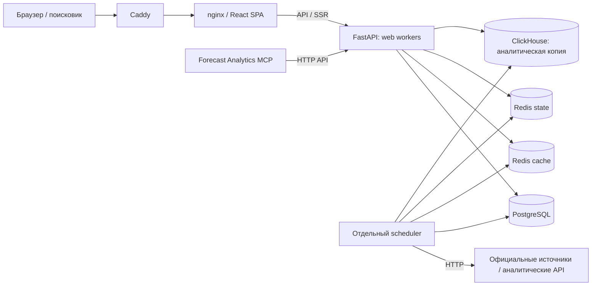

# Forecast Economy — аналитическая платформа официальной макроэкономической статистики по странам

**Аналитика, локальный пакет 30.09:** расчёт сессии учитывает продолжение
через окна и поздние события; event-копия ClickHouse использует committed
ceiling, ограниченный replay и уникальные ID в метриках.
[Проверки и открытый дефект CH session-копии](docs/code-review/analytics-boundaries-acceptance-2026-09-30.md).
Это локальная реализация, не выпуск на сервер.

**Региональные данные, локальный пакет 30.09:** содержательная сверка
годового артефакта сохраняет историю, месячный bootstrap сохраняет значения
ЕМИСС. API/SSR/OG получают новое поколение после commit; подробности —
[региональная приёмка](docs/code-review/regional-publication-acceptance-2026-09-30.md).

**Надёжность данных, локальный пакет 30.09:** сохранение истории при частичном
national response и публикация кэша после commit. Контракты и проверки —
[приёмка](docs/code-review/history-publication-acceptance-2026-09-30.md).
Пакет не означает выпуск на production или новую оценку нагрузки сервера.

Платформа для сбора, анализа и публикации официальных экономических данных по странам. Источники — национальные статистические ведомства, центральные банки, Евростат и МВФ; по России покрытие особенно глубокое (Росстат, Банк России, Минфин, 85 субъектов). Прогнозы, ежедневный ETL, SSR + SEO, embed-виджеты, календарь публикаций, live ticker (USD/EUR/CNY/BTC/Brent), аналитический MCP. Английский канон: [forecasteconomy.com](https://forecasteconomy.com); русский: [ru.forecasteconomy.com](https://ru.forecasteconomy.com).

**Точка входа в документацию (для AI-агентов и людей):** [`AGENTS.md`](AGENTS.md) — карта документации, режим работы, протокол актуализации.
**Domain glossary и инварианты:** [`CONTEXT.md`](CONTEXT.md).
**Рельеф всего проекта:** [`docs/project-terrain.md`](docs/project-terrain.md) — Graphify, полный Git-инвентарь и проверка актуальности.
**Приёмка и границы полноты:** [K01–K12 по подсистемам](docs/project-knowledge-acceptance.md) · [backend inventory](docs/mechanism-inventory.md) · [client inventory](docs/client-mechanism-inventory.md) · [неизвестное и проблемы](docs/knowledge-unknowns.md).
**Как всё связано:** [`архитектура`](docs/architecture.md) · [`контракты данных`](docs/data-contracts.md) · [`история решений`](docs/architecture-history.md).
**Обязательный цикл при каждой задаче:** [`docs/knowledge-workflow.md`](docs/knowledge-workflow.md); рецепты владельца — [`docs/agent-recipes.md`](docs/agent-recipes.md).
**Содержательная дельта frontend/docs 30 сентября:** [`отчёт`](docs/code-review/frontend-docs-delta-2026-09-30.md): локальный код, история и ограничения полноты.
**Рабочий процесс, локальный dev, прод-деплой:** [`docs/workflow.md`](docs/workflow.md).
**Источники данных:** [`docs/data_sources.md`](docs/data_sources.md) (per-indicator карта `URL/endpoint/sheet/row`); parser internals — в docstrings `backend/app/services/*_parser.py`.
**Архитектурные решения:** [`docs/adr/`](docs/adr/) (ADR-0001..0016).
**Backlog работ:** [`docs/backlog.md`](docs/backlog.md).
**Поиск по всем контурам:** [`docs/search.md`](docs/search.md): глобальная
палитра стран/регионов/рядов, локальные селекторы, таблицы и телеметрия.
Новая версия 30.09 реализована локально; исторический read-only экспорт
и 150 реальных клиентских путей — [отчёт](docs/research/search-history-2026-09-30.md).
V2 добавляет составные вопросы, native units и защиту точных названий;
[полный исторический replay и новые независимые промахи](docs/research/search-history-replay-2026-09-30.md)
показывают границы качества. Универсальное понимание языка не подтверждено.
Доработка 01.10 разделяет источник/частоту результата, год наблюдения/базу цен
и проверяет точные native срезы; история и случайные выборки оцениваются отдельно.

## Архитектура

**Сверено с кодом 2026-09-27.** В Compose web backend и scheduler — разные
процессы одного образа. Данные разделены на российские ряды, регионы России,
world и субнациональные регионы других стран. Точная топология, потоки и основания
связей — в [архитектуре](docs/architecture.md). Этот кодовый обзор не подтверждает
состояние production. Предыдущая схема с APScheduler внутри web backend
заменена по текущим `docker-compose.yml` и `backend/entrypoint.sh`.



**Уточнение URL 2026-09-30:** страна задаёт основные пути (`/russia/...`,
`/{country}/indicator/{code}`); валюты имеют отдельный раздел `/currencies`
и `/currencies/indicator/{code}`, включая производные и периоды. Источник —
backend `site_paths.py` и frontend `sitePaths.js`. Наличие этих путей в main
не заменяет проверку выпущенного SHA и живых редиректов.

## Стек

### Backend

- **FastAPI** + **Uvicorn** — async REST API.
- **PostgreSQL 16** + **SQLAlchemy 2** (asyncpg) + **Alembic**.
- **Redis 7** — отдельные cache (`volatile-lru`) и state (`noeviction`, AOF); инвалидация через версионированные namespace.
- **APScheduler** — отдельный сервис `scheduler`: ETL 06:00/20:00 MSK, late-Minfin 15:00, календарь 03:00; дополнительные jobs и флаги — в `app/tasks/` и `app/main.py`.
- **statsmodels** — расчёт прогнозов; стратегии определены в `forecast_strategies/registry.py`, мировой pipeline изолирован.
- **pandas / openpyxl / xlrd / beautifulsoup4 / requests / httpx** — парсинг XLSX, HTML и API.
- **Alerting** — JSON-логи в stdout + Telegram-канал для критических сбоев.

### Frontend

- **React 19** + **Vite 7** + **Tailwind 4** (актуальные дизайн-контракты — в `docs/design/`).
- **TanStack React Query 5** — data fetching и кэш.
- **Recharts** — графики; **ECharts** — аналитические визуализации; **GSAP 3** — анимации.
- **React Router 7** + **Axios** + **Lucide** + **@sentry/react**. Excel/CSV создаёт backend; `xlsx` в frontend dependencies отсутствует.
- **Nginx** внутри `frontend` контейнера — раздаёт статику Vite-сборки и проксирует публичные SSR-пути к backend `/seo/*` для браузеров и роботов; переход в SPA и исключения определяет маршрутизация.

### Инфраструктура

- **Docker Compose** — 7 сервисов: `postgres`, `redis`, `redis-state`,
  `backend` (3 web worker), `scheduler` (фоновые задачи), `frontend`, `clickhouse`.
- **Caddy** — внешний reverse-proxy, HTTPS-сертификат, CSP-политики (Yandex.Metrika, Sentry, Webmaster, шрифты).
- **Yandex.Metrika** + **Yandex.Webmaster** — публичная аналитика и контроль индексирования.
- **Forecast Analytics OS / MCP** — отдельный модуль для агрегации Yandex.* данных и сценариев в backend (см. `docs/analytics_api_inventory/`).

## Быстрый старт

### Локально через Docker Compose

```bash
test -f .env || cp .env.example .env
docker compose up -d --build
```

Backend `entrypoint.sh` сам:

1. Применяет Alembic-миграции (`alembic upgrade head`).
2. Идемпотентно применяет `seed_data.py` (российские ряды, включая derived).
3. Запускает `seed_regional.py`; сбой на пустой региональной БД останавливает startup.
4. Сидит календарь публикаций на 12 месяцев вперёд.
5. Поднимает Uvicorn. Роль `scheduler` пропускает миграции/seed и стартует после healthy backend.

После этого:

- API: `http://localhost:8000/api/v1/...`
- Swagger: `http://localhost:8000/api/docs` (только при `DEBUG=true`).
- Frontend: `http://localhost:3000` (через nginx из контейнера `frontend`).

### Только фронтенд против прода (без локального backend)

```bash
cd frontend && npm install && npm run dev
```

Vite-прокси по умолчанию направляет `/api` на `https://forecasteconomy.com` — графики и форкасты работают на реальных данных, без поднятия Postgres/Redis локально.

Чтобы переключиться на локальный backend, добавьте в `frontend/.env.local`:

```
VITE_DEV_API_PROXY=http://127.0.0.1:8000
```

## Проверки и регламент

- **Общие локальные проверки:** `./scripts/check-all.sh` — pytest + frontend lint/test/build + guards документации. CI дополнительно проверяет миграции, Docker и E2E.
- **Полный регламент:** см. [`docs/workflow.md`](docs/workflow.md).
- **Чеклист устойчивости (rate limit, CORS, asset-hash, бэкап):** [`docs/enterprise_resilience.md`](docs/enterprise_resilience.md).

## API

Base URL: `/api/v1` (за исключением SSR-эндпоинтов `/seo/*` и `/sitemap.xml`).

**Полная и всегда актуальная документация** — Swagger при `DEBUG=true`: `http://localhost:8000/api/docs`. На проде Swagger физически отключён.

Ключевые группы endpoint'ов:

| Группа | Что отдаёт |
|--------|------------|
| `/indicators/*` | список / детали / точки / статистика / прогноз / накопленная инфляция (CPI) |
| `/search` | public read-only discovery стран, территорий и доступных рядов; q до 256, limit до 100, has_more и explicit empty reasons; локальная версия — [контракт](docs/search.md) |
| `/calendar/*` | публикации в диапазоне, ближайшие, iCal-фид (источник: ADR-0005) |
| `/ticker/live` | live снимок USD/EUR/CNY/BTC/Brent из Redis (TTL 90с, MOEX + Binance + CBR fallback) |
| `/embed/*` | spark/card/badge SVG-виджеты + impression-pixel |
| `/dashboard/sparklines` | bundle sparkline'ов главной |
| `/analytics/*` | Forecast Analytics OS (Yandex.* через MCP, требует токен) |
| `/seo/*`, `/sitemap.xml`, `/og/*` | SSR-meta-bundle, sitemap, OpenGraph-картинки (источник: ADR-0003) |
| `/health`, `/system/status` | liveness + сводка по ETL и расписанию |

## Индикаторы

Российский каталог включает 12 категорий. Ряды seed, видимые карточки, world-ряды и URL — разные счётчики: кодовый срез ниже проверяет `scripts/audit-doc-counters.py`, публичное покрытие сверяется по API/БД.

| Категория (slug) | DB category | Покрытие |
|------------------|-------------|----------|
| `prices` | Цены | ИПЦ (общий, food/non-food/services), ИЦП, недельная инфляция |
| `rates` | Ставки | Ключевая ставка ЦБ (с 1992), RUONIA, ставки по кредитам и депозитам (с term split) |
| `currencies` | Валюты | USD/RUB, EUR/RUB, CNY/RUB, BTC/USD, Brent |
| `finance` | Деньги и бюджет | M0/M1/M2, золото, резервы, внешний долг, бюджет (доходы/расходы/дефицит) |
| `indices` | Индексы | Биржевые индексы Московской биржи |
| `commodities` | Товарные рынки | Официальные ряды цен сырья и топлива |
| `labor` | Рынок труда | Безработица, номинальная (с 1991) / реальная / индекс / YoY зарплата |
| `gdp` | ВВП | ВВП номинальный/реальный/потребление/госрасходы (+ annual/QoQ/YoY) |
| `population` | Население | Численность, рождаемость, смертность, миграция, пенсионеры, трудоспособное |
| `trade` | Торговля | Экспорт/импорт товаров и услуг (quarterly + monthly), trade-balance, current account, FDI |
| `business` | Бизнес | ИПП (default YoY), розница, ввод жилья, индекс доступности жилья, основные фонды |
| `science` | Наука | Аспиранты, докторанты, организации НИР, инновационная активность, R&D |

Source-индикаторы (118) извлекаются через 34 парсер-типа в `PARSER_REGISTRY` (`backend/app/services/*_parser.py`; 32 используются в seed, `cbr_dataservice_sum`/`cbr_monetary_html` зарегистрированы про запас); derived рассчитываются движком `calculation_engine` через `DERIVED_SPECS` (829 спеков: 44 ручных + 785 сгенерированных view-mode-семьями) + 28 чистых ops из `derived_ops.py` (см. ADR-0001 и ADR-0002). Дублирующие карточки в каталоге объединены через 109 generic view-mode family (ADR-0006); всего в seed 947 рядов.

## Прогнозы

14 forecast strategies в реестре `backend/app/services/forecast_strategies/registry.py`: `annual_auto`, `cpi_combined`, `gdp_{nominal,real,consumption,government}_quarterly`, `housing_quarterly`, `ppi_monthly`, `monthly_auto`, `generic_quarterly` (положительные квартальные: exports/imports/external-debt), `signed_quarterly` (знаковые квартальные сальдо: current-account), `approved`, `derived_from_source` (включая op=`subtract` — тождество trade-balance = exports − imports), `generic_ols`. Стратегия выбирается через `model_config_json.forecast_strategy` индикатора и применяется через retrain pipeline при изменениях факта. Eligibility и ограничения частоты задаются в коде и policy-тестах; наличие стратегии само по себе не обещает публичный прогноз.

Полная таблица «стратегия → индикаторы → notebook» и поля `model_config_json` — в [`CONTEXT.md::Forecast`](CONTEXT.md). Pure formulas стратегий — `backend/app/services/forecast_strategies/*.py`; derived chain — в `derived_ops.py` (ADR-0001).

Мировые прогнозы изолированы в `world_forecasts`: свежий регулярный месячный
или квартальный primary-series публикует прогноз только после rolling-origin
проверки `MASE < 1` и выигрыша у seasonal-naive. Новый provider получает такой
допуск только явно, после проверки официального adapter и provenance
(ADR-0012).

## Структура проекта

```
rosstat/
├── backend/
│   ├── app/
│   │   ├── api/            # FastAPI routes (indicators, forecasts, calendar, embed,
│   │   │                   #   dashboard, demographics, analytics, system, seo, sitemap)
│   │   ├── core/           # cache (Redis), deps, helpers
│   │   ├── services/       # parsers, forecaster, calculation_engine,
│   │   │                   #   derived_ops, calendar_seed, alerting, seo_renderer
│   │   ├── tasks/          # scheduler, analytics_scheduler
│   │   ├── analytics/      # Forecast Analytics OS — Yandex clients, warehouse, MCP
│   │   ├── config.py       # pydantic-settings
│   │   ├── database.py     # async engine, sessionmaker
│   │   ├── models.py       # ORM (Indicator, IndicatorData, Forecast, FetchLog, …)
│   │   └── main.py         # FastAPI app + lifespan + middleware
│   ├── alembic/            # миграции
│   ├── certs/              # Russian Trusted CA (нужен для https-походов на Росстат)
│   ├── seed_data.py        # идемпотентный seeder российского каталога
│   └── entrypoint.sh
├── frontend/
│   ├── src/
│   │   ├── components/     # Navbar, Footer, Chart, MetricCard, EmbedHelpers, …
│   │   ├── pages/          # Home, Category, IndicatorDetail, Calendar, Embed, …
│   │   └── lib/            # api client, categories.js, formatters, hooks
│   ├── nginx.conf          # SPA + SSR routing + asset hashing
│   └── Dockerfile
├── scripts/
│   ├── check-all.sh        # pytest / frontend / guards документации
│   ├── pg-backup.sh        # pg_dump перед прод-деплоем
│   ├── deploy.sh           # выпуск до одобренного SHA, smoke и rollback
│   ├── sync-local-from-prod.py
│   ├── rebuild-all-derived.py
│   ├── seo-audit.py
│   └── analytics-smoke.py
├── docs/
│   ├── adr/                # архитектурные решения (ADR-0001..0015)
│   ├── analytics_api_inventory/  # инвентарь Yandex API (Metrika, Webmaster, …)
│   ├── data_sources.md     # карта «индикатор → файл/endpoint» (118 source)
│   ├── missed_data_audit.md  # reference: ещё не извлечённые поля в source-файлах
│   ├── workflow.md         # dev процесс, smoke C, прод-деплой
│   ├── enterprise_resilience.md  # rate limit / CSP / asset-hash trap / канарейка
│   └── backlog.md          # живой бэклог (приоритеты + история)
├── mcp/                    # Forecast Analytics MCP (отдельный запуск; не сервис Compose)
├── Caddyfile
├── docker-compose.yml
├── CONTEXT.md              # глоссарий и архитектурный язык — главная точка входа
└── README.md
```

## Деплой

См. полную процедуру в [`docs/workflow.md::Прод-деплой`](docs/workflow.md). Ключевые моменты:

1. Деплой проводится через `scripts/deploy.sh` до явно одобренного SHA; проверяется весь диапазон миграций от текущего релиза.
2. Preflight вызывает `scripts/pg-backup.sh` (custom dump + отдельная identity-копия). Offsite и restore проверяются отдельно от успешного локального dump.
3. Согласованно обновляются backend, scheduler и frontend; новые ассеты публикуются до HTML, сохраняется возможность отката.
4. После запуска нужны readiness, SSR/API/OG smoke, проверка ассетов и post-deploy watch. Подробные команды и границы приёмки — в workflow.

## Что автоматизировано

| Процесс | Как |
|---------|-----|
| Миграции БД | Web-role `entrypoint.sh` → `alembic upgrade head`; scheduler-role пропускает миграции/seed |
| Первичный seed | Web-role `entrypoint.sh` → идемпотентный `seed_data.py` |
| Startup catch-up | `app/main.py::_catch_up_empty_indicators()` — в отдельной scheduler-role после lifespan startup догоняет ETL для всех `is_active=true` индикаторов с 0 точками (новые индикаторы дотягиваются без ручного `run_etl_for_indicator`) |
| Ежедневный ETL | Отдельный scheduler: cron 06:00 и 20:00 MSK (активные российские source-ряды через `PARSER_REGISTRY`) + late-Minfin 15:00 |
| Calendar refresh | APScheduler daily 03:00 MSK: official-source ingest, rolling 12 мес, public official-only |
| Forecast retrain | Изменения, ревизии и поддерживаемые удаления факта проходят `BaseParser` → retrain pipeline |
| Derived recompute | Каскадно после ETL (если хотя бы один source-индикатор обновился) |
| Cache invalidation | `cache_invalidate_indicator` повышает версии namespace; порядок относительно DB commit описан в [контрактах](docs/data-contracts.md) |
| Auto-restart | `restart: unless-stopped` для всех сервисов |
| Russian Trusted CA | Сертификат в `backend/certs/` для походов на Росстат |
