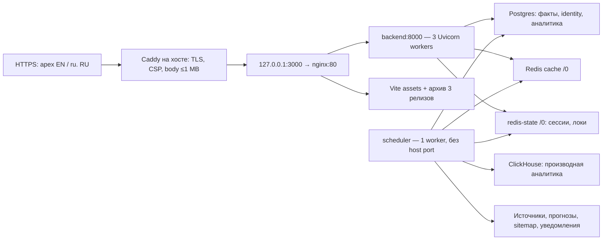

# Архитектура Forecast Economy: карта действующего кода

## Граница визита и event-копии — уточнение 2026-09-30

Пакет после локальной `main 83c4555` отделяет логическую сессию от трёхдневного
вычислительного окна. PostgreSQL оконными функциями восстанавливает bursts,
owning start и затронутую историю; Python stream/staging сохраняют ограниченный
рабочий набор. Commit окна исправляет старые splits и carry вместе. SQL читает
историю посетителей окна: ограничение Python RAM не ограничивает объём SQL-work.

Event-копия CH сначала получает committed ceiling под коротким PG SHARE NOWAIT,
затем закрывает PG и копирует конечные батчи в executor. При занятом source
копирование откладывается; новый revision cursor делает bounded historical
replay. После retry raw MergeTree может содержать дубли, event-метрики считают
уникальные id. Metadata различает catch-up/deferred и завершённость captured
среза. Это не lease/outbox/CDC и не атомарный snapshot всех таблиц.

**F05b (с 2026-10-04 закрыт локально журналом `server_session_changes`, см. контракт ниже; не выпущен):** CH session-copy не удаляет старые visitor/start и не выбирает carry
старше двух суток; FINAL этого не исправляет. PG BI/marts и CH session-срезы
поэтому могут различаться после backfill. [Контракт](data-contracts.md#аналитические-окна-и-репликация-f05f06--2026-09-30),
[проверки и ресурсные пределы](code-review/analytics-boundaries-acceptance-2026-09-30.md).
Сохраняются отдельный analytics pool, low-memory CH profile и прежние причины
инцидентов. Production 4 vCPU, смешанная нагрузка и release не приняты заново.

## Региональные writers и consumers — уточнение 2026-09-30

После `main c2a883d` региональный сидер объединяет годовые значения по ключу,
сохраняя отсутствующую в файле историю; месячный артефакт вставляет только
недостающие точки. ЕМИСС пересматривает полученные месячные значения. Все
metadata/annual/monthly изменения сидера атомарны, каждый месяц ЕМИСС имеет
свою транзакцию. Границы каталога строятся из сохранённой истории обеих частот.
Commit owner пытается опубликовать `regions`, `ssr-region`, `og-region`;
API и memory/disk OG теперь используют поколения, SSR уже использовал их.
Статические sitemap shards публикуются отдельным job. Политика месячного
конфликта не заменяет per-point provenance; Redis остаётся best-effort.
[Контракт](data-contracts.md#региональный-контур-f03--2026-09-30),
[проверки и пределы](code-review/regional-publication-acceptance-2026-09-30.md).


**Локальное уточнение 30.09, после `main 506122b`:** национальный adapter
явно задаёт полноту и окно ответа; merge сохраняет историю по умолчанию.
CalculationEngine — SQL-only, публикация source/derived принадлежит commit
owner. Eurostat публикует country/remap/slice после commit; отдельный slice
атомарен, весь dataset — нет. [Контракты](data-contracts.md),
[приёмка и границы](code-review/history-publication-acceptance-2026-09-30.md).
Бюджет 4 vCPU и серверный снимок этим локальным исправлением не измерены заново.

**Срез:** 2026-09-27, локальная ветка `main`. Точный базовый commit, SHA-256 файлов и незакрытые места приведены в [реестре содержательного разбора](code-review.md). Состояние сервера зафиксировано отдельно ниже и в [runtime-inventory.json](runtime-inventory.json). Важные исторические причины решений остаются в [CONTEXT](../CONTEXT.md), [ADR-0003](adr/0003-seo-single-source-server-rendered.md), [ADR-0006](adr/0006-indicator-card-unification.md), [ADR-0013](adr/0013-country-first-url-architecture.md) и [истории архитектуры](architecture-history.md). Для счётчиков URL используйте `/sitemap-stats.json` и `docs/site-inventory.json`, а не старые числа в документах.

**Сквозные находки и приоритеты:** [итоги разбора](code-review-findings.md) связывают ограничения адаптеров с записью в БД, публичными страницами, аналитикой и ресурсами сервера. Найденный механизм отделён от воспроизведения и от наблюдения production.

**Машинная навигация:** [рельеф проекта](project-terrain.md) и [JSON-граф](project-terrain.json) дают полный файловый инвентарь и статические связи; интерактивный HTML строится из JSON локально и не хранится в Git. При изменении кода обновить срез и проверить drift:

```bash
/Users/iprofi/.codex/tools/graphify-venv/bin/python scripts/build-project-terrain.py --refresh --tracked-only
python3 scripts/build-project-terrain.py --check --tracked-only
python3 scripts/build-project-terrain.py --render
```

Переносимый вариант: создать `python3 -m venv /tmp/fe-graphify-venv`, установить туда `graphifyy==0.9.69` через `python -m pip install`, затем вызвать `--refresh` его Python. `--render` и `--check` используют стандартную библиотеку, без Graphify. Полные промежуточные `.artifacts/project-terrain/` локальны и игнорируются Git. Извлечённая связь — подсказка для поиска, не доказательство выполненного вызова; ручные сквозные контракты ниже проверены исходниками.

### Как проверяется полнота и актуальность

Реестр [code-review](code-review.md) учитывает каждый файл явно выбранного среза. Публикуемый срез main использует Git tracked/index inputs (`--tracked-only`); чужие untracked материалы не входят в него автоматически. Worktree scope с неигнорируемыми файлами доступен как отдельный режим. У текстового исходника фиксируются прочитанные диапазоны, назначение, контракты, эффекты, ошибки, зависимости и границы тестов. Каждое именованное определение Python/JavaScript, включая вложенные функции, проверяется на наличие собственной аннотации. Для массивов данных и бинарных ресурсов отдельно отмечается проверка схемы или метаданных: она не означает проверку каждой экономической точки или каждого пикселя.

`python3 scripts/audit-code-documentation.py --check --tracked-only` выявляет пропущенные рецензии, изменённые исходники, непрочитанные диапазоны и определения без описания. Генератор не присваивает статус «прочитано». Нулевой список пропусков измеряет полноту зафиксированных свидетельств; он не доказывает корректность всех рабочих сценариев, качество каждого описания или отсутствие дефектов. Доказательства работы приложения — отдельные тесты и датированные проверки среды.

Первый смысловой граф `architecture-knowledge.json` содержал основания из 68 файлов и остаётся историческим артефактом первоначального выборочного прохода. Его прежние утверждения и контрольные суммы не переписываются автоматически. Текущий разбор и устаревание показываются отдельно в реестре и просмотрщике. Старые документы и восстановленные из Git материалы сохраняют даты и причины решений в [индексе истории](architecture-history.md).

Структура Graphify включает исходники, HTML/CSS/Mako и конфигурацию; один файловый узел учитывается отдельно от подробной структуры. Группы по путям и матрица отношений помогают найти код, но не устанавливают runtime-связи через HTTP, БД и Redis. Сквозные сценарии описаны ниже и в контрактах.

После изменения исходника необходимо перечитать diff и затронутые контракты, обновить рецензию, затем пересобрать покрытие и структуру. Простая замена hash не является повторным разбором. Просмотрщик автономен и показывает состояние на момент сборки; он не следит за будущими правками файлов в реальном времени.

**Backend-уточнение 2026-09-30, локальная main `972579f`:** [содержательная дельта](code-review/backend-delta-2026-09-30.md) подтверждает annual horizon=1 в изменённых seed/strategy/API/world/territory путях; допустимая поправка неполного годового факта сохраняется, серверная перетренировка этим чтением не доказана. Python `visit_is_robot`, SQL `metrika_visit_not_headless` и CH raw visits используют разные выборки; их агрегаты нельзя автоматически считать одинаковым человеческим трафиком. В Eurostat loader `apply_remaps` фиксирует metadata отдельным commit, `persist_result` — отдельной транзакцией parsed slice, `bump_namespaces` выполняется лишь в конце loader; это не атомарная замена dataset. Точные пути, границы ошибки и следующие проверки — в отчёте.

## C4: контекст системы

Forecast Economy показывает официальные экономические ряды России, стран и регионов, их представления, сравнения и допустимые прогнозы. Человек получает интерактивную карточку, поисковый робот — полный HTML того же публичного адреса; администратор видит отдельную BI-витрину. Основание: маршруты [SPA](../frontend/src/App.jsx), [API](../backend/app/api/router.py), [SSR](../backend/app/api/seo_pages.py), модель [Indicator/WorldIndicator/RegionIndicator](../backend/app/models.py).

| Внешний участник / система | Связь с проектом | Источник |
|---|---|---|
| Посетитель и поисковый робот | Публичные country-first URL, API, SSR/OG/sitemap; часть страниц остаётся чистым HTML | `frontend/nginx.conf` — SSR location; `backend/app/services/site_paths.py`, `seo_renderer.py::build_document`, `site_urls.py` |
| Официальные поставщики | ETL забирает и нормализует ряды; РФ, национальные источники мира и субнациональные паспорта имеют разные ingest-контуры | `backend/app/services/rosstat_cpi_parser.py::PARSER_REGISTRY`, `world_national_ingest.py`, `world_subnational_ingest.py` |
| OAuth-провайдеры | Вход через отдельный callback, затем серверная сессия | `backend/app/api/oauth.py::oauth_callback`, `backend/app/services/session.py` |
| Системы измерения и доставки | First-party behavior, импорт Метрики/GSC/Вебмастера и уведомления/IndexNow выполняются отдельными путями; внешние данные не являются базой публичных рядов | `frontend/src/lib/behavior.js`, `backend/app/api/analytics.py`, `backend/app/main.py` — scheduler registrations, `backend/app/services/site_urls.py` |

## C4: контейнеры и границы

Следующая таблица описывает [docker-compose.yml](../docker-compose.yml) и [Caddyfile](../Caddyfile), без вывода о том, какие именно флаги включены в текущем production.

| Контейнер / процесс | Ответственность и граница | Код и конфигурация |
|---|---|---|
| Caddy | TLS/внешний reverse proxy к локальному порту frontend | `Caddyfile` — `reverse_proxy 127.0.0.1:3000`; серверный checkout совпал 30.09, старый снимок 27.09 содержал `localhost` |
| Frontend nginx | Статика Vite, `/api/` proxy, `/seo/*` proxy для публичных URL, legacy redirects, sitemap и OG-маршруты | `frontend/nginx.conf` — `/api/`, `/russia/indicator`, `/assets/`; `docker-compose.yml::frontend` |
| React SPA в браузере | Интерактивные страницы, роутинг, TanStack Query, локаль, сессия и поведенческий поток | `frontend/src/main.jsx`, `SpaRoot.jsx`, `App.jsx`, `lib/hooks.js`, `context/AuthProvider.jsx`, `lib/behavior.js` |
| FastAPI web | `/api/v1`, SSR HTML, sitemap/OG, авторизация, ingestion behavior; несколько HTTP workers без фонового расписания в Compose | `backend/app/main.py::app`, `api/router.py`, `api/seo_pages.py`, `api/sitemap.py`; `docker-compose.yml::backend` |
| Scheduler | Тот же backend image, отдельная роль без публичного порта: ETL, forecast, rollups, sync, обслуживание sitemap и уведомления | `docker-compose.yml::scheduler`, `backend/app/main.py::lifespan`, `tasks/scheduler.py` |
| PostgreSQL | Истина для индикаторов, точек, пользователей, сессий аналитики и агрегатов | `backend/app/models.py`, `backend/app/database.py`, `docker-compose.yml::postgres` |
| Redis cache / Redis state | Первый — версионированные cache namespace; второй — состояние сессий и распределённых job locks | `backend/app/core/cache.py::versioned_key/bump_namespaces/get_state_redis`, `backend/app/services/session.py`, `docker-compose.yml::redis/redis-state` |
| ClickHouse | Восстанавливаемая аналитическая копия Postgres для BI-срезов; публичная запись идёт в Postgres | `backend/app/services/clickhouse_sync.py`, `backend/app/services/analytics_marts.py`, `docker-compose.yml::clickhouse` |

## Реальное окружение: сервер с 4 vCPU и локальная разработка

**Повторное наблюдение 2026-09-30, 13:40 UTC (16:40 МСК).** Ресурсы хоста, семь контейнеров, readiness, выбранные effective Settings, PostgreSQL head и существующие backup прочитаны без изменения сервера: [снимок 30.09](code-review/runtime-observation-2026-09-30.json). Полный исходный снимок **27.09, 12:24–12:34 UTC** со схемой БД, флагами, томами и хостовыми настройками сохранён [отдельно](code-review/runtime-inventory-2026-09-27.json); [runtime-inventory.json](runtime-inventory.json) связывает оба наблюдения. Ни одна величина не становится постоянной настройкой только из-за записи в документе; строки пользователей и секреты не публикуются.

### Дополнение механизмов 30.09, local main `05302ff`

Поздняя [ops-проверка](code-review/ops-mechanism-acceptance-2026-09-30.md) и её
[полный JSON](code-review/ops-mechanism-acceptance-2026-09-30.json) расширили ранний
снимок: 160 Settings-полей/consumers/defaults/Compose mapping, все 7 service/mount/limit
контракты, host units/network/sysctl и 402 backend payload-файла работающих web/scheduler.
Все 402 совпали с серверным checkout; единственное отличие от local main — комментарии
`ticker_worker.py`. Frontend image содержит проверенные 264 dist-файла и все 6 index bundles.
Caddy active JSON равен адаптированному `/etc/caddy/Caddyfile`, а его файл — checkout.

Повторный restore с синтетическим исходным role `rustats` **без подавления owner/ACL**
завершился за182,967с; owners сохранены, nondefault table ACL=0. Current backend на restored
БД прошёл HTTP API/readiness/email-auth/CSRF и сохранение session после очистки только
своего cache Redis; current nginx — CPI/currency SSR и все shell assets. Вторая пустая
своя БД прошла34 migrations/metadata+regional seed/startup (947 indicators,961494 regional
points), без scheduler/jobs и внешней сети. Offline CBR calendar failure не остановил
startup. Client JS был из прежнего local image; full browser/production failover не заявлен.

Два конструкционных расхождения теперь объяснены: host logrotate всё ещё rotate14/compress/
copytruncate, хотя main — rotate7/nocompress/rename+USR1; 9 имён `.env.example` не передаются
этим Compose. `PUBLIC_HOST` исторический и не читается текущим Caddy. Найден active host
`tor-http-bridge.service`: gateway8888→Tor9050, вне Git. Его hardcoded Basic credential и
логирование headers — подтверждённый дефект; в публичном свидетельстве credential редактирован.
Provider control plane/SLA/offsite — явная недоступная область, capacity/RTO — неизмеренные
свойства, RPO/RTO targets — непринятое бизнес-решение; они не смешиваются с устройством.

### Версии кода и процессы

30.09 `/opt/rosstat` — чистый Git на **`367ff336a307ad57d528b26078ca35883ec3de68`** (approval wrapper выпуска `535f226`). Локальная main при повторной сверке — `972579f`. Семь выбранных файлов **серверного checkout** (`docker-compose.yml`, `backend/entrypoint.sh`, `scripts/pg-backup.sh`, `scripts/deploy.sh`, `frontend/nginx.conf`, `backend/app/config.py`, `Caddyfile`) побайтово совпали с локальными исходниками. Это не аттестация всех файлов работающих images. Исторически 27.09 сервер был на `e81b86e`, а 11 выбранных файлов web/scheduler/nginx совпали с тем серверным Git; полное свидетельство сохранено с первоначальной датой.



Caddy запущен через systemd на хосте, в Compose его нет. 30.09 backend, scheduler, frontend, Postgres, два Redis и ClickHouse были healthy, restart count 0, `OOMKilled=false`. Readiness web проверяет БД и оба Redis; проверка scheduler появляется в readiness **самого scheduler**, где расписание включено. Оба ответа были `status=ok`, `degraded=false`. Это не проверка успешности каждого задания или всех пользовательских маршрутов.

### Бюджет CPU, памяти и диска

| Ресурс | Фактически на сервере | Что учитывать при изменении архитектуры |
|---|---|---|
| CPU | 4 логических vCPU, x86_64, KVM/QEMU | Квоты ограничивают процессорное время, ядра между контейнерами не закреплены |
| RAM | 8 326 946 816 байт ≈7,75 GiB | Лимиты контейнеров не являются заранее зарезервированной памятью |
| Swap | ≈4 GiB; занято около 0,40 GiB 30.09 (0,74 GiB в снимке 27.09) | Наличие занятых страниц не доказывает текущий thrashing; нужны rates/latency во времени |
| Диск `/` | ≈76,45 GiB; занято 79%, доступно ≈16,65 GiB 30.09 (88% / ≈9,8 GiB 27.09) | На том же диске находятся БД, Docker, локальные бэкапы, логи и архив ассетов |
| ОС | Ubuntu 24.04.4 LTS, kernel 6.8.0-139-generic (наблюдение 27.09) | `vm.swappiness=60`, `overcommit_memory=0`; provider storage/IOPS/SLA не установлены |
| Docker | Engine 29.6.1, cgroup v2 (наблюдение 27.09) | У фактических контейнеров нет cpuset; memory+swap limit вдвое больше RAM limit |

| Сервис | Workers | CPU quota | RAM hard limit | Существенные ограничения |
|---|---:|---:|---:|---|
| backend | 3 | 3 CPU | 2304 MiB | Пулы и in-process кэши умножаются на 3; nofile 65536 |
| scheduler | 1 | 1 CPU | 1024 MiB | Startup catch-up и фоновые джобы делят один контейнер; nofile 65536 |
| frontend | nginx | 0,5 CPU | 256 MiB | SSR проксируется в backend, nginx хранит статику |
| postgres | PostgreSQL | не задана | 3072 MiB | Shared memory 256 MiB, stop grace 120s |
| redis | Redis | не задана | 448 MiB | `maxmemory=384 MiB`, на сервере **allkeys-lru** |
| redis-state | Redis | не задана | 64 MiB | `maxmemory=48 MiB`, noeviction, AOF everysec |
| clickhouse | ClickHouse | 0,5 CPU | 448 MiB | Query memory 300 MiB, threads 2, external sort/group thresholds 150 MiB |

Сумма RAM hard limits — **7616 MiB (7,44 GiB)**. Если все контейнеры одновременно приблизятся к лимитам, для хоста останется лишь около 325 MiB: прежний комментарий «около 1 GB запаса» не является гарантией. Caddy, Docker, системные процессы и page cache тоже требуют ресурсов. Фактический `MemAvailable` 30.09 был около 3,14 GiB (3,09 GiB 27.09): сумма лимитов не равна текущему расходу. CPU-квоты web+scheduler дают 3+1, но nginx, ClickHouse, Postgres и хост конкурируют за те же четыре vCPU. Значения квот и swap трактуются по [документации Docker](https://docs.docker.com/engine/containers/resource_constraints/).

Нельзя вывести допустимое число посетителей из «4 ядра» или одного healthy-ответа. При переразбиении сервисов считать совокупные пулы/память и измерять смесь cold/warm SSR, API, ETL и BI, p95/p99, queue wait, CPU throttling, disk latency, swap-in/out и OOM. Новый worker увеличивает конкуренцию и память; он не добавляет серверу ядра.

### PostgreSQL: память, соединения, схема

Сервер: `shared_buffers=896 MiB`, `effective_cache_size=2304 MiB`, `work_mem=16 MiB`, `maintenance_work_mem=256 MiB`, `autovacuum_work_mem=128 MiB`, до 3 autovacuum workers. `effective_cache_size` — оценка для планировщика, не выделение памяти. `work_mem` расходуется на операцию сортировки/хеширования и может умножаться на план и parallel workers; это не фиксированные 16 MiB на соединение ([PostgreSQL 16](https://www.postgresql.org/docs/16/runtime-config-resource.html)). `jit=off`, `random_page_cost=1.1`, `track_io_timing=on`, `pg_stat_statements` в preload, slow query threshold 1000ms.

Максимальный бюджет SQLAlchemy по фактическим настройкам полного снимка 27.09; web 8+7 и analytics 2+2 повторно подтверждены 30.09:

```
web:       3 × (pool 8 + overflow 7)             = 45
scheduler: 1 × (pool 6 + overflow 6)             = 12
analytics: 4 процесса × (pool 2 + overflow 2)    = 16
                                                   73
```

`max_connections=100`, `superuser_reserved_connections=3` проверен на сервере. Остаток до 97 обычных соединений — 24 при одновременном максимуме всех пулов; Alembic, seed, CLI и backup тоже подключаются. Поздняя сверка 30.09 установила, что app-role `rustats` — superuser и может занять reserved slots: это консервативный бюджет, а не enforced изоляция от приложения. Это верхние пределы, соединения открываются по потребности. Web pool timeout 3s, scheduler/analytics 15s. В приложении public statement timeout 30s, analytics 60s, idle-in-transaction 120s; глобальные PostgreSQL `statement_timeout=0`/`idle_in_transaction_session_timeout=0` не отменяют session-level настройки приложения.

В полном снимке **27.09** серверная БД занимала 6 481 599 511 байт; публичная схема содержала **60 таблиц и 672 колонки**, включая `alembic_version`, с head `20260924_oauth_locale`. Перечень колонок, типов, nullability и defaults сохранён в историческом JSON. **30.09** серверный head уже `20260927_world_nonzero_idx`, та же ревизия восстановлена из свежего dump; старое утверждение «миграция ещё не применена» больше не является текущим. В восстановленном dump 58 public-таблиц и `research.source_catalog` (59 всего). Это схема backup на 04:00 UTC, а не новый полный live-инвентарь колонок; свежая полная инвентаризация live-схемы пока не проведена.

### Кэш и состояние: сервер отличается от локального профиля

На сервере cache Redis `/0` использует `allkeys-lru`; `.env.example`/Compose default — `volatile-lru`. 30.09 cache использовал почти все 384 MiB (402652792 байт из 402653184); текущая скорость eviction не измерялась. Снимок 27.09 содержал ≈380,7 MiB и накопительный счётчик 622534. Effective Settings web 30.09 подтверждают отдельный `redis-state:6379/0`; noeviction+AOF и прежние ≈12,5 MiB / 0 вытеснений относятся к полному снимку 27.09, не к новому замеру памяти state.

В **локальной main** поколение `world-catalog` и durable last-good хранятся в state Redis, публикация атомарная, ключи `g2`, есть single-flight/stale grace. Исторически **27.09 на e81b86e** проверенные `core/cache.py` и `api/world.py` были старее. **В ранней сверке 30.09, 13:40 UTC checkout обновлён до 367ff336**, но эти image-файлы ещё не сравнивались. Поздняя [аттестация 402 payload-файлов](code-review/ops-mechanism-acceptance-2026-09-30.json) установила их SHA-паритет с checkout у web и scheduler; это filesystem evidence, не проверка каждого состояния БД/job. Cache fail-open, quota/lockout/session state и namespace generation имеют разные режимы отказа — подробности в [контрактах](data-contracts.md).

В снимке **локального Docker-стека 27.09** контейнер `redis-state` существует, однако оба процесса приложения используют `redis:6379/1`. Это отдельная логическая БД того же cache-инстанса, с общей памятью и eviction policy, а не физическая изоляция. Переключение адреса state меняет доступное состояние сессий/локов; при аудите оно не выполнялось.

### Сохранность, расписание и внешние действия

Root cron сервера запускает `scripts/pg-backup.sh` в **04:00 UTC =07:00 МСК** (`Etc/UTC` на хосте). `TZ=Europe/Moscow` внутри backend не меняет timezone host cron. APScheduler использует собственную московскую timezone.

30.09 в `/opt/rosstat/backups` — 92 файла, ≈15,61 GiB; последний полный dump `rustats_20260930_040001.dump`, **434247670 байт**, завершён 04:02:14 UTC. Старые 70 файлов / 10,97 GiB / dump 27.09 остаются в историческом снимке. `OFFSITE_S3_BUCKET`/endpoint по-прежнему не заданы, `aws` CLI отсутствует: **S3-ветка этого скрипта не настроена**. Независимый backup провайдера не проверен.

**Доставка и restore 30.09 проверены отдельно.** Локальный `~/bin/fe-backup-pull.sh` исправлен с сохранением исходной версии: исключено переиспользование SSH control socket, заданы keepalive/таймауты. Свежие `.dump` и `.identity.sql.gz` скачаны на Mac в `~/Backups/forecasteconomy`, размеры/SHA-256 совпали с сервером, повторный запуск пропустил проверенные файлы. Полный dump восстановлен за **154,885 с** в отдельном PostgreSQL 16 без сети/портов (1 CPU, 1 GiB RAM); identity SQL восстановлен в другой пустой БД с совместимой схемой. Constraints валидны, сирот identity нет. Собственные контейнер/том удалены после проверки labels. [Протокол и границы](code-review/backup-acceptance-2026-09-30.md): это проверка восстановления схемы/данных без исходных owner/ACL, не замер полного failover или согласование RTO/RPO.

В полном снимке **27.09** на сервере включены analytics ingestion/live writes, ClickHouse, IndexNow, Pulse, Telegram digest/poller/realtime alerts, Eurostat/subnational/BEA ingest. `analytics_scheduler_enabled=false` — отдельный флаг; его нельзя подменять общим `scheduler_enabled=true`. Global world forecast выключен, отдельные US/Europe forecast gates включены (caps 500/3000). Реестр заданий и их зависимость от флагов смотреть в разборе `main.py`/tasks; наличие флага не доказывает успешную последнюю загрузку.

**27.09** хостовые Caddy/fail2ban/logrotate конфиги совпали с серверным checkout. Тогда jail limits: nginx-429 30 событий/600s → ban86400s; nginx-volume 80/600s →86400s; honeytrap 1/3600s →172800s; recidive 2/86400s →604800s. Это отдельный слой после nginx rate limits; список заблокированных IP не собирался. **30.09, ранняя сверка:** Caddy/nginx checkout совпали с main, host-loaded конфиги ещё не аттестованы. **Поздняя сверка:** Caddy active JSON совпал с disk-adapted/checkout; `nginx -T` и image config проверены, writable config changes отсутствуют. Effective host logrotate при этом старый: rotate14/compress/copytruncate против main rotate7/nocompress/rename+USR1. См. [ops-досье](code-review/ops-mechanism-acceptance-2026-09-30.md). В текущем nginx есть адресная блокировка трёх сетей Alibaba (`43.119.0.0/16`, `47.78.0.0/15`, `47.80.0.0/14`); отключённый `fe_bind` не означает отсутствие этого сетевого правила.

**Метрики.** Инструментация `/api/v1/metrics` существует. Effective `Settings.metrics_token` web 30.09 пуст: endpoint по коду отвечает 403, рабочий scrape этим наблюдением не подтверждён. Readiness был успешен у web и scheduler, но это не измерение latency/throughput и не проверка каждой джобы. Включение токена/коллектора не выполнялось.

### Локальная машина и проверяемый маршрут

**Полный локальный снимок 27.09:** MacBook M3 Pro, 11 CPU, 18 GiB RAM, macOS **26.6.2** на момент проверки (старая запись 14.5 неактуальна). Docker Desktop VM: 11 CPU, ≈7,65 GiB RAM, Engine 29.1.3 (Docker ресурсы повторно доступны при restore 30.09). Локальные контейнеры имеют тот же Compose профиль лимитов; Docker VM сама почти равна сумме этих лимитов. Это не эквивалент Linux VPS по CPU, файловой системе и IO.

| Адрес на localhost | Назначение | Что он не подтверждает |
|---|---|---|
| `3000` | nginx + backend SSR + собранные Vite assets | TLS/Caddy, host fail2ban и production-флаги |
| `5173` | Vite HMR/CSR | SSR/OG/nginx и актуальность контейнерного image |
| `8000` | FastAPI напрямую | Caddy/nginx headers, compression и rate limits |
| `5434` | Postgres container:5432 | Совпадение данных с сервером |
| `6380` | Cache Redis container:6379 | Выделенный state Redis |

**Состояние локального приложения в следующем абзаце — снимок 27.09; restore 30.09 его не заменяет.** Backend/SSR code не bind-mounted: после смены main работающий image может оставаться старым. Срез локальных images создан 26 сентября, последующие коммиты main сами в контейнеры не попали. Запуск Vite читает рабочие frontend файлы. Последовательности локального старта, настройки proxy и точные границы проверки — [workflow](workflow.md#локальная-разработка).

## C4: основные компоненты backend

| Контур | Источник истины и путь | Публичный выход / проверка |
|---|---|---|
| Индикаторы РФ | `backend/seed_data.py::INDICATORS` + `rosstat_cpi_parser.py::PARSER_REGISTRY` → `base_parser.py::BaseParser.run` → `models.py::IndicatorData`; `calculation_engine.py::DERIVED_SPECS` использует `derived_ops.py` и generated specs из `view_model_families.py` | `api/indicators.py` — meta и `/data`; `backend/tests/test_calculation_engine.py`, `test_view_model_families.py` |
| Прогнозы | `model_config_json.forecast_strategy` выбирает `forecast_strategies/registry.py::resolve`; старый fallback ещё существует | `api/forecasts.py`; snapshot-тесты `backend/tests/forecast_strategies/` |
| Мир | Паспорт `app/data/world_national_core/*.yaml` → `world_national_ingest.py`/`world_source_adapter.py` → `WorldIndicator`, `WorldDataPoint`, `WorldDatasetState`; Eurostat и IMF имеют отдельные адаптеры | `api/world.py`, `api/world_subnational.py`; SSR через `api/seo_pages.py` |
| Регионы | Российские `Region*` и мировые `Subnational*` — разные модели/маршруты; международный субнациональный ingest берёт `SubnationalPassport` | `api/regions.py`, `api/world_subnational.py`; `models.py` |
| Календарь | Правила официальных источников и рабочий календарь, отдельно от ряда индикатора | `services/calendar_sources/official_calendar.py`, `api/calendar.py` |
| SEO | `seo_content.py`/`indicator_seo.py` и поля БД → `seo_renderer.py::build_document`; `index_policy.py` решает canonical/noindex, `site_urls.py` формирует URL-шарды | `api/seo_pages.py`, `api/sitemap.py`, `frontend/nginx.conf`; `backend/tests/test_seo_og.py` |
| Auth | `api/auth.py` и `api/oauth.py` создают server-side сессию; `security/auth.py` проверяет session/CSRF; admin BI проверяет роль отдельно | `api/admin_bi.py`; `frontend/src/context/AuthProvider.jsx`; auth-тесты |
| Аналитика | `behavior.js` → `api/analytics.py` → Postgres; `tasks/analytics_rollups.py` → `services/analytics_marts.py` и периодический `clickhouse_sync.py` | `api/admin_bi.py` → `frontend/src/pages/AdminBI.jsx`; `backend/tests/test_analytics2.py` |
| Установка как приложение (локально 05.10, не выпущено) | `api/pwa.py` (манифест и офлайн-страница по Host, `GET /api/v1/pwa/config` с выключателями `pwa_enabled`/`pwa_install_prompt_enabled`) → `frontend/public/sw.js` (кэш только офлайн-страницы и иконки) и `frontend/src/lib/pwa.js` + `pwaPolicy.js` (регистрация, политика приглашения) | `frontend/nginx.conf` (location манифеста/`sw.js`), `Caddyfile` (CSP); `backend/tests/test_pwa.py`, `frontend/src/lib/serviceWorker.test.js`, `pwa*.test.js*` |
| Подготовка web-push, без отправки (локально 05.10) | `api/push.py` (`/push/subscribe`, `/unsubscribe`, 404 пока `push_subscribe_enabled=false`) → `models.PushSubscription` (миграция `20261005_push_subscriptions`); `services/web_push.py` отправку отклоняет (`push_send_enabled`, `push_dry_run`, ключи VAPID из окружения); клиент `lib/pushSubscription.js` не подключён | `backend/tests/test_push.py` (в т.ч. «ни одно задание планировщика не отправляет»); `scripts/generate-vapid-keys.py` |
| Замер спроса на платный API (локально 05.10) | `api/api_interest.py` (`GET /api-interest/config`, `POST /api-interest`; honeypot, лимит по IP/почте в Redis) → `alerting.notify_api_interest` → Telegram и `telegram_outbox`; таблицы заявок нет | `backend/tests/test_api_interest.py`, `frontend/src/components/ApiInterest.component.test.jsx` |
| Витрина «Прогнозы» (локально 05.10, не выпущено) | `services/forecast_showcase.py::build_showcase` (Россия: `forecasts`/`forecast_values`; мир: проверенные `world_forecasts`; проекции МВФ не хранятся) → Redis `world / forecast-showcase:v1:{locale}` → `api/forecast_showcase.py` (`GET /api/v1/forecasts/showcase`) и `services/seo_forecasts.py` (`/seo/page/forecasts`); с 08.10.2026 кэш прогревается при старте процесса планировщика (последний шаг `_startup_data_catch_up`) и его задачей `forecast_showcase_warm` каждые 20 минут (`api/forecast_showcase.py::warm_showcase_cache`; ключ в контракте — `v3`); платформенная страница `/forecasts` (`site_paths.forecasts()`) | `backend/tests/test_forecast_showcase.py`; [контракт](data-contracts.md#forecasts-showcase) |
| Лента курсов: тип источника и основа курса (локально 05.10) | `services/ticker_sources/__init__.py` (`source_kind`, `source_label`, `as_of`) → `api/ticker.py` (`/ticker/live` добавляет подписи при выдаче; `/ticker/rates/{usd-rub|eur-rub|cny-rub}`: ЦБ и биржа отдельно) → клиент `LiveTicker.jsx` читает только `/ticker/live` и определяет подпись по `snapshot.source` (`tickerSourceKind`); `/ticker/rates` и `source_*` пока без потребителя | `backend/tests/test_ticker_basis.py`; [контракт](data-contracts.md#ticker-rates-basis) |
| SSR «Главное» страны и 404 в оболочке (локально 05.10) | `services/seo_country_figures.py` + `seo_world.render_world_country_html` (`#key-figures`, `#fe-country-bootstrap`); `seo_renderer.render_not_found_html`/`compose_document(not_found=True)` (флаг `window.__feNotFound`); `frontend/nginx.conf` (фирменные `429/50x`, `/search` → 301) | `backend/tests/test_seo_country_figures.py`, `test_seo_not_found.py`, `test_branded_errors.py`; [контракты](data-contracts.md#country-ssr-key-figures) |
| Лимит API (конфигурируемый) | `main.py::RateLimitMiddleware` читает `RUSTATS_API_RATE_LIMIT` (120/мин) и `RUSTATS_EMBED_RATE_LIMIT` (600/мин) из окружения; тестовый стенд поднимает оба до 6000 (`scripts/test-server/docker-compose.override.yml`) | [контракт](data-contracts.md#rate-limit-config); [workflow, тестовый сервер](workflow.md#тестовый-сервер-демо-стенд-за-cloudflare) |
| Курсы лиры и тенге, главные цифры страны, календарь по показателю (локально 08.10, не выпущено) | `cbr_fx_parser.py::CURRENCY_MAP` (`try-rub` `R01700J`, `kzt-rub` `R01335`) → `seed_data.py` и `FamilyDef` T1 → `site_paths.py::_CURRENCY_BASE_CODES` (и зеркало `sitePaths.js`) → `/currencies/indicator/{code}`; `api/world.py` (`_OVERVIEW_PRIORITY`, `basis*` у цен, `country:v19`, `ind:v23`) → `global_market_indicators.COUNTRY_CURRENCY_RATE_CODES`; `api/calendar.py` (`/calendar/upcoming?indicator_code=&event_type=`); `ecb_fx_parser.py` через `create_session()` | `backend/tests/test_circle9_f.py`; [контракт](data-contracts.md#c9-data-2026-10-08) |

### Компоненты браузерного приложения

| Зона | Основные модули и договорённость |
|---|---|
| Shell/navigation | `frontend/src/main.jsx` создаёт QueryClient; `SpaRoot.jsx` оборачивает React в provider; `App.jsx` лениво загружает страницы и фиксирует порядок маршрутов `/russia`, `/:countrySlug`, legacy. |
| Данные | `frontend/src/lib/api.js` задаёт API transport, locale/CSRF и retry; `lib/hooks.js` задаёт query keys/stale time. Возвращаемые API payloads читаются страницами, а не копируются в отдельную browser-БД. |
| Карточка РФ | `pages/IndicatorDetail.jsx` выбирает generic либо существующий bespoke стек; `lib/viewModeEngine.js` читает generated-конфиг, `components/GenericIndicatorView.jsx` и `lib/useGenericViewModeData.js` собирают активный ряд. |
| Мир и регионы | `pages/WorldCountry.jsx`, `WorldIndicatorPage.jsx`, `WorldRegionProfile.jsx`, `RegionProfile.jsx` разделяют национальные, субнациональные и российские сценарии; API routes различны (`api/world.py`, `world_subnational.py`, `regions.py`). |
| Поиск, локальная версия 30.09 | `IndicatorSearch` → `useGlobalSearch` → `/search`; `searchSynonyms` ранжирует локальные eligible pools, `tableSearch` фильтрует загруженные точки. Data planes остаются раздельными; [основной контракт](search.md). |
| Identity/BI/analytics | `context/AuthProvider.jsx` держит `/auth/me` в QueryClient, `pages/AdminBI.jsx` требует `is_admin`, `lib/behavior.js` и `lib/track.js` отправляют first-party события. Серверная проверка доступа остаётся в FastAPI. |
| PWA, push-подготовка, опрос API (05.10) | `main.jsx` и `App.jsx` подключают `lib/pwa.js` (регистрация `sw.js`, `appinstalled`, standalone) и `PwaInstallPrompt`; пункт «Установить приложение» — `PwaInstallEntry` в `Footer.jsx`; `lib/pushSubscription.js` нигде не импортируется (тест следит); `ApiInterestLink` в `IndicatorChartSection.jsx` и `DownloadLimitModal.jsx` открывает `ApiInterestModal` через `lib/apiInterest.js`, флаг приходит из `/api-interest/config`. События — в `lib/track.js` и [инвентаре](analytics_api_inventory/frontend_instrumentation.md). |
| Дизайн-система «хрусталь без границ» (05.10; палитра холодная и без «игровых» элементов с круга 6, 06.10; не выпущено) | токены и слои стекла в `styles/z1-tokens.css` (фон `#F4F5F7`, графит и синий, золото тонким акцентом), страж палитры в `styles/z1-tokens.test.js`, растры 2× — `public/brand/manifest.json` + `styles/no-lowres.test.js`, страж `styles/no-borders.test.js`; сцена света `components/LightScene.jsx` + `lib/sceneBudget.js` (атрибуты `<html data-fe-motion/data-fe-lite>`); оболочка `Navbar.jsx`, `LiveTicker.jsx`, `MobileDock.jsx`, `BottomSheet.jsx`, `lib/useFooterTone.js`; бренд `components/brand/*`, `Brand.jsx`, `Footer.jsx`; графики `lib/chartTheme.js` (факт синяя лента, прогноз тонкое золото, без диапазона), `ChartGlassDefs.jsx`, `lib/glassChartDefs.js`; ассеты `public/brand/*`. Основной документ — [design-system](design-system.md), решение — [ADR-0018](adr/0018-crystal-without-borders-design-system.md). |
| Нижний слой телефона, карта и страна (круг 9, 08.10, не выпущено) | `lib/stickyLayer.js` (`html[data-fe-sticky]`, `--fe-sticky-h`) делят `CalcStickyResult`, `MobileDock` и CSS; `useScrollDirection().rest`; `lib/pwaPolicy.js` (`isDataPath`, 30/15 с); `PlanetView.*` (карточка страны в окне карты, `highlightTop`, `homeCountryCode`); `lib/countryIndicatorGroups.js`, `countryKeyFigures.js` (`orderKeyFigures`, `inflationCaption`), `CountryIndicatorRow.jsx` (группы, порции, архив); `lib/compareCompatibility.js` (`MACRO_TWINS`); `lib/currencyRates.js::unitMeta`; `lib/calendarIcs.js` (`.ics`); `lib/searchRecent.js` | [design-system](design-system.md#krug-9-status), [search](search.md#c9-search-2026-10-08) |
| Страница «Прогнозы», 404 в оболочке, «Главное» страны | `pages/ForecastsPage.jsx` + `lib/forecastShowcase.js` (маршрут `/forecasts`, `lib/navItems.js::FORECASTS_TO`); `App.jsx::ServerNotFoundGate` (флаг `window.__feNotFound`) и `pages/NotFound.jsx`; `lib/countryBootstrap.js` читает `#fe-country-bootstrap`, `components/country/CountryKeyFigures.jsx` берёт точки из предзагрузки или из `/world/indicators/*/data`. |

## Сквозные сценарии и контракты

### 1. Карточка индикатора: URL → ряд → график

Это source-backed codemap одного потока; стрелки означают вызов или передачу выбранного `code`, а не измеренную последовательность сетевых запросов.

```mermaid
flowchart LR
  A["/russia/indicator/wages-nominal?mode=avg-year"] --> B["nginx: /seo/indicator/{code}"]
  B --> C["seo_pages → seo_renderer: HTML/meta"]
  C --> D["React App → IndicatorDetail"]
  D --> E["viewModeEngine: FamilyDef projection"]
  E --> F["GenericIndicatorView → useGenericViewModeData"]
  F --> G["GET /api/v1/indicators/{resolved.code}/data"]
  G --> H["Postgres: IndicatorData"]
```



`FamilyDef` для `wages-nominal` направляет `avg-year` к `wages-nominal-annual`; это видно в `backend/app/data/view_model_families.py` (около строк 833–838) и `frontend/src/lib/viewModelFamilies.generated.json`. Resolver задаёт `code`, `unit`, `frequency`, `forecastable` (`frontend/src/lib/viewModeEngine.js::resolveViewMode`); hook грузит точки именно выбранного кода (`useGenericViewModeData.js`); API отвечает `DataResponse` (`backend/app/api/indicators.py::indicator_data`, `backend/app/schemas.py::DataResponse`). Исторические и derived-точки создаются до чтения: `backend/app/tasks/scheduler.py::daily_update_job`, `calculation_engine.py::run_for_updated_sources`. См. [playbook](indicator-family-playbook.md) и [ADR-0006](adr/0006-indicator-card-unification.md).

**Текущий выбор UI-стека:** `IndicatorDetail.jsx` сначала проверяет `getViewModeFamily(code)` и возвращает `GenericIndicatorView`; `cpi`/`housing`/`ppi` имеют отдельный bespoke-путь. Variant (`indicatorVariants.js`) выбирает другой экономический срез/код, `?mode=` — представление среза. `shadowed_legacy` в `docs/indicator-index.json` относится к перекрытой ветке рендера: некоторые старые модули сохраняют content/resolve и canonical redirects; [расследование](dead-code-report.md).

**Frontend↔API контракт:** axios `baseURL=/api/v1`, `X-FE-Locale` и CSRF-header для mutations в `frontend/src/lib/api.js` и `frontend/src/i18n/locale.js` (быстрые SSR-страницы ведут на платформу мостом, [контракт](data-contracts.md#ssr-quicklink-bridge); ответы `/api/` несут `Vary: X-FE-Locale`, `LocaleMiddleware` в `backend/app/main.py`, [контракт](data-contracts.md#api-vary-locale)); React Query keys включают `code`, для каталога также локаль и flags (`frontend/src/lib/hooks.js`). Отрисовка должна брать единицу и частоту **выбранного** режима/ряда, а не автоматически от родителя (`GenericIndicatorView.jsx`, `useGenericViewModeData.js`). Точечный static review по Vercel React practices: страницы в `App.jsx` уже lazy-loaded; совпадающие TanStack Query keys могут переиспользовать один результат. При этом `IndicatorDetail.jsx::useIndicatorViewModeData` вызывается до generic early-return, а generic-hook может запросить другой `code`. Это **гипотеза о лишней подписке/запросе** в derived-режиме, не измеренный дефект; проверять Network по конкретному `?mode=` до оптимизации.

### 2. SSR, robots и видимая картинка

`frontend/nginx.conf` проксирует indexable routes в `api/seo_pages.py`, где кэшируется HTML и вызывается `seo_renderer.py`; `build_document` собирает canonical, locale-dependent hreflang, JSON-LD, OG и видимое тело. Для индикатора и годовых landing рендерер добавляет `<figure class="seo-chart">`, а `api/sitemap.py` отдаёт соответствующий PNG. `site_urls.py` и `index_policy.py` исключают редиректные URL. Обычная карточка убирает `?mode=` из canonical; зарегистрированный годовой режим России сохраняет его при точном stored-series resolver и конечном факте года (дополнение ADR-0003 от01.10). Источники: `frontend/nginx.conf` — строки 334–536; `backend/app/api/seo_pages.py` — SSR routes; `backend/app/services/seo_renderer.py::build_document/render_indicator_html/render_indicator_year_html`; `backend/app/services/site_urls.py`, `index_policy.py`.

**Граница терминов:** SPA использует `createRoot` (`frontend/src/main.jsx`), а SSR-тело скрывается после первого React commit (`frontend/src/SpaRoot.jsx`, `frontend/src/lib/spaReveal.js`). Это клиентский mount/замена, **не React `hydrateRoot`**. Чистые HTML landing работают с `include_app=False` и не требуют SPA. Историческая формулировка «hydration» в ADR/комментариях описывает пользовательский переход, но не API React.

### 3. Страны, регионы и локаль

SPA-маршруты России находятся под `/russia`, другие страны — под `/:countrySlug`, мировой рейтинг — `/world/rating` (`frontend/src/App.jsx`). Nginx и SSR строят те же публичные пути через `site_paths.py`; legacy paths получают редирект, часть старых indicator URL идёт через semantic redirects в backend (`frontend/nginx.conf`, `backend/app/data/legacy_redirects.py`). Язык публичного канона определяется host/cutover-флагом в `services/locale.py`; `main.py::_locale_host_redirect` может направить человека с apex на `ru.` по явному выбору или гео при включённом флаге, а поисковых роботов оставляет на запрошенном хосте. Не выводить состояние флага в production из кода или хронологии ADR-0013.

### 4. Авторизация и BI

`AuthProvider` читает `/auth/me`, кэширует гостя как `null` при 401/403 и передаёт `user` UI (`frontend/src/context/AuthProvider.jsx`). `api.js` шлёт cookie на same-origin и `X-XSRF-TOKEN` при мутации; `api/auth.py` выдаёт сессию через `services/session.py`, `api/oauth.py` завершает внешний вход. `/admin/bi` виден только после серверной admin-проверки; `api/admin_bi.py` строит тяжёлый snapshot вне времени жизни запроса и возвращает 202 при cache miss. Источник: названные файлы; см. [ADR-0009](adr/0009-behavior-stream-first-party.md) для first-party потока.

### 5. Аналитика и данные для решений

Браузерный `behavior.js` пакетирует события и отправляет `/api/v1/analytics/behavior`; сервер нормализует/пишет их в Postgres (`api/analytics.py`). Scheduler регистрирует `analytics_rollups` и `clickhouse_sync`; `analytics_marts.py` — читаемые витрины, а ClickHouse — производный OLAP-слой для срезов (`backend/app/main.py`, `tasks/analytics_rollups.py`, `services/clickhouse_sync.py`). Следовательно, аналитические цифры нельзя смешивать без определения единицы: событие, сессия и визит Метрики проходят разными контурами. Границы и принятые определения — [CONTEXT](../CONTEXT.md) и [ADR-0010](adr/0010-analytics-contour-identity-goals-marts-olap.md).

### 6. Федеративное обнаружение данных (локальная версия 2026-09-30)

`IndicatorSearch.jsx` → `useGlobalSearch.js` → `api/search.py` →
`services/search_intent.py` и `services/search.py` → существующие модели
России/world/регионов/subnational → `search_paths` и `site_paths` →
SPA либо period document. Fact/geography/date и поддержанные explicit
frequency constraints предшествуют ограничению больших SQL наборов.
Но world hidden-year/month-frequency destination checks остаются после
budget, canonical year+mode — после batch resolution; их eligibility
не является гарантией полного retrieval. Finite value не равен
ненулевому signal (последний дополнительно требуется только world).
Глобальная выдача включает территории, но не объединяет таблицы или ETL.
V2 добавляет `search_language`/`search_vocabulary` (предмет и роль),
`search_units` (нативные quantity facets) и `search_language_sql` (общие
типовые guards до LIMIT). `search_dimensions` проверяет реальные оси Eurostat
по provider/slice_json и использует нормативные member labels. Подтверждённые
native имена/коды защищаются от внутренних дат, географии и `%`; bounded
preflight проверяет целый span, а внешние уточнения остаются обязательными.
Агрегат-остаток имеет intent, но не новый delivery route.
Составные понятия предшествуют typo отдельных слов. Небольшой title-IDF
bonus работает только внутри уже доступного набора, не заменяет retrieval.
World sibling/merge destinations читаются одной metadata SELECT на ranked
порцию; eligibility территорий проверяется пакетами, не per-row SQL.
Annual региональный период требует annual факта, hidden world period
закрыт без listed SSR eligibility. Native world level — сохранённая мера
(включая rate), не обязательно индекс; география DXY/US10Y допускает США
по действующему market issuer registry общего Indicator контура.

Браузер ждёт settled query 200 мс, cache key включает locale/query/limit,
а также ревизию клиента `v3`; IME composition не отправляет промежуточный
ввод, не выбирает результат через Enter и не логирует его как готовый query.
Старые строки скрыты при смене query; ошибки допускают retry и не считаются
пустым ответом. Shared local matcher действует внутри допустимого pool
каждой страницы/сравнения/калькулятора/виджета; таблица имеет отдельный
predicate дат/значений. Новых search jobs/таблиц/серверного cache и
внешних ML-вызовов нет. Query telemetry идёт прежним `track()` collector
в `frontend_events`; candidate keys означают returned/rendered rows,
не viewport impressions. Исторические клавиши между debounce отсутствуют.

[ADR-0016](adr/0016-federated-public-search.md) уточняет первоначальный
discovery запрет ADR-0008, сохраняя storage/частоты/прогнозные основания.
[search.md](search.md) содержит endpoint schema, полный инвентарь полей,
candidate budgets, unsupported периоды, матрицу и локальные проверки;
[исторический аудит](research/search-history-2026-09-30.md) — отдельно
фактический read-only экспорт и 150 реальные пути. Production release,
exhaustive matrix acceptance и trained ranking этим кодовым потоком не
подтверждаются.

## Контрольные точки и риски изменений

| Изменение | Что сверить до «готово» | Основание |
|---|---|---|
| Новый/изменённый индикатор | Источник/история → `FamilyDef`/derived → generated JSON → `ui_stack`/variant → SEO/listing/forecast → главная; использовать локальную матрицу completeness | `docs/indicator-index.json`, `scripts/build-indicator-index.py`, `docs/indicator-family-playbook.md`, [рецепты агента](agent-recipes.md) |
| Публичный URL/локаль | nginx + SPA + SSR + `site_paths` + `site_urls` + OG + canonical/hreflang; проверять оба языка и старые 301 | `frontend/nginx.conf`, `frontend/src/App.jsx`, `backend/app/services/{site_paths,site_urls,seo_renderer,index_policy}.py` |
| Замена legacy view-mode | Проверить imports контента и canonical redirects до удаления; `shadowed_legacy` не delete-list | `docs/dead-code-report.md`, `frontend/src/pages/IndicatorDetail.jsx` |
| Оптимизация React | Сначала зафиксировать Network/render measure, затем проверять query keys, lazy chunks и повторные подписки | `frontend/src/main.jsx`, `App.jsx`, `lib/hooks.js`, `pages/IndicatorDetail.jsx`; Vercel React best practices |
| Данные/BI | Отделять public DB pool от analytics pool; cache miss BI может выполняться фоном, ClickHouse синк — производный | `backend/app/api/admin_bi.py`, `backend/app/services/clickhouse_sync.py`, `backend/app/database.py` |

Локальные guards: `./scripts/check-all.sh` (тесты, lint, build и проверки карт), `backend/tests/test_seo_og.py`, `backend/tests/test_view_model_families.py`, frontend `viewModeEngine.test.js`, `scripts/e2e/smoke.mjs`. Для SSR используйте локальный Compose `:3000`; Vite `:5173` не подтверждает nginx/SSR. После локальной проверки отдельно фиксируются commit, push, deploy и production acceptance по [workflow](workflow.md) и [design review](design/README.md).

## Шесть коротких маршрутов чтения кода

Эти маршруты составлены по методу «действие пользователя → конкретный вызов → данные → проверка». Каждый занимает одну сквозную задачу; читать файлы в указанном порядке и в конце ответить на контрольный вопрос.

| # | Пользовательское действие и путь | Что понять и чем проверить |
|---|---|---|
| 1 | Открыть `/russia/indicator/wages-nominal?mode=avg-year`: `App.jsx` → `IndicatorDetail.jsx` → `viewModeEngine.js` → `useGenericViewModeData.js` → `api/indicators.py` → `models.py` | Почему график берёт `wages-nominal-annual`, где подменяются частота/единица; тесты `viewModeEngine.test.js` и `test_view_model_families.py`. |
| 2 | Обновить официальный ряд: `tasks/scheduler.py` → `rosstat_cpi_parser.py::PARSER_REGISTRY` → `base_parser.py` → `calculation_engine.py`/`derived_ops.py` → `forecast_strategies/registry.py` | Откуда берётся первичная точка, когда пересчитывается derived и когда стратегия допускает прогноз; `test_calculation_engine.py`. |
| 3 | Открыть ссылку из поиска: `frontend/nginx.conf` → `api/seo_pages.py` → `seo_renderer.py` → `site_urls.py`/`index_policy.py` → `api/sitemap.py` | Как согласованы HTML, canonical, видимый график и sitemap; проверить SSR body и `test_seo_og.py`. |
| 4 | Выбрать другую страну/регион: `App.jsx` → `api/world.py`/`world_subnational.py` → `world_national_ingest.py`/`world_subnational_ingest.py` → `models.py` | Различить национальный и субнациональный набор, его provider и состояние загрузки; `backend/tests/test_world.py`, `test_world_subnational.py`. |
| 5 | Войти и открыть кабинет: `context/AuthProvider.jsx` → `lib/api.js` → `api/auth.py`/`api/oauth.py` → `security/auth.py`/`services/session.py` | Где заканчивается UI-гейт и где сервер проверяет cookie/CSRF/admin; auth-тесты и 401/403/404 сценарии. |
| 6 | Посмотреть BI: `lib/behavior.js` → `api/analytics.py` → `tasks/analytics_rollups.py` → `analytics_marts.py` → `api/admin_bi.py` → `pages/AdminBI.jsx` | Отличить event, session, visit и производный CH-срез; проверить `test_analytics2.py` и состояние 202/stale snapshot. |

## Как применены исследованные навыки

В этом проходе навыки служили **методами чтения и проверки**, а не новыми конкурирующими документами. Пробные результаты сохранены вне репозитория в `~/.codex/skill-research/RESEARCH-2026-09-27.md`; здесь указано, что дошло до текущей документации.

| Навык | Фактический вклад и граница |
|---|---|
| Graphify | Полное статическое извлечение, проекция между файлами и hash guard в [рельефе](project-terrain.md); semantic doc↔code дополнение хранится отдельно от автографа. Статика не заменяет runtime. |
| codebase-discovery | Кодовый recon variant/view mode, источника и исторического годового ряда; доменные правила сверены в [playbook](indicator-family-playbook.md). Интервью с владельцем не проводилось. |
| improve-codebase-architecture | Проверка границ ETL, BI и data contract привела к явным рискам в [контрактах](data-contracts.md) и [надёжности](enterprise_resilience.md); runtime не рефакторился этим документом. |
| codemap | Ручной проверенный поток `wages-nominal → annual` стал Mermaid-картой выше; отдельный интерактивный пилот остался вне репозитория. Mermaid не доказывает HTTP-count. |
| c4-codebase-architecture | Разделение контекста, контейнеров и компонентов в первых разделах этой карты; Caddy идёт к nginx, прямого ребра Caddy→backend нет. |
| codebase-summary | Source ledger для entrypoints, API, хранилищ и главного user journey в этой карте. |
| react-best-practices | Узкий review lazy routes, Query keys и generic hook дал гипотезу для Network-замера; Next.js/SWR-правила не переносились буквально на Vite. |
| testing-strategy | Контрактные проверки и разделение static/runtime/production описаны в [контрактах](data-contracts.md) и [workflow](workflow.md); результаты локального `check-all` и проверок навигатора зафиксированы в [backlog](backlog.md#2026-09-27--рельеф-проекта-и-актуализация-документации). |
| disaster-recovery | Разбор backup-success и пределов RTO/RPO уточнил [надёжность](enterprise_resilience.md); 27.09 restore не проводился, [30.09 проверен свежий full/identity dump](code-review/backup-acceptance-2026-09-30.md) в изолированном PostgreSQL. |
| writing-plans | Последовательность проверок и gate по одобренному SHA отражена в [workflow](workflow.md); сам план не означает деплой. |
| code-tour | 10-шаговый файл [`.tour`](../.tours/architect-view-mode-contract.tour) Python→JSON→React прошёл статическую проверку файлов/шагов; VS Code extension не устанавливали, для Codex доступны маршруты выше. |
| acquire-codebase-knowledge | Scanner запущен для root/backend/frontend; его false negative по вложенным manifest/entrypoint восполнен прямым чтением. Его семь областей распределены по README, этой карте, [контрактам](data-contracts.md), [workflow](workflow.md), [надёжности](enterprise_resilience.md) и рельефу; семь дублей не создавались. |
| zoom-out | Сквозная проверка ETL→cache→API, SSR→SPA и behavior→BI удерживает границы системы рядом с подробными модулями. |
| codebase-to-course | Фазы анализа и проектирования учебной последовательности адаптированы в шесть маршрутов чтения выше. HTML-курс/квизы не собирались; целью здесь был короткий учебный путь внутри существующей документации. |

## Что эта карта не подтверждает

Первоначальный кодовый проход 27.09 не запускал application browser/E2E, ETL, миграции или release smoke; браузерная проверка касалась навигатора рельефа. Флаги, схема и effective конфигурация **не отсутствуют**: они датированно зафиксированы в [полном снимке 27.09](code-review/runtime-inventory-2026-09-27.json) и [повторной ops-сверке 30.09](code-review/runtime-observation-2026-09-30.json). [Первое restore-учение 30.09](code-review/backup-acceptance-2026-09-30.md) проверяло schema/data без application acceptance. [Поздняя проверка механизмов](code-review/ops-mechanism-acceptance-2026-09-30.md) добавила owner/ACL, HTTP restored API/email-auth/nginx SSR и чистый startup; её bounded сценарии не являются full browser/production failover. Не установлены текущие QPS/p95/p99/LCP/CLS, capacity при одновременном ETL/BI/SSR, актуальный полный live-инвентарь колонок, provider backup/SLA, полный failover/RTO/RPO, число индексируемых страниц и количество HTTP-запросов React в выбранном режиме. Для них нужны отдельные проверки, а не вывод из графа или healthy.


### Уточнение поиска 01.10: единицы, срезы и годовой режим

Проценты и процентные пункты — разные обязательные native facets. USD для
общей подписи dollars допускается только при объявленной валюте US state
producer; чужая валюта и отсутствующая unit не угадываются. Literal preflight
сохраняет целое действительное название внутри rawquery вместе с его
внутренними страной/датой/%; внешние слова, год, география и единицы остаются
обязательными. Это исправляет прежнюю описанную границу internal-title.

Eurostat slice qualifiers проверяют конкретную ось и её storedmember,
до candidateLIMIT и в Python. Total другой оси, category/SEO и отсутствующий
JSONmember не являются доказательством; ordinary bareall не снимается.
Слова о ежедневном использовании внутри economicdefinition отделены от
частоты наблюдений. Этот словарь конечен и не является обученной моделью.

Годовой поиск России может вернуть parent/year?mode только если shared
resolver рендерит тот же actualcode, для которого есть конечные факты года.
SSR использует nativeданные/единицу/title этого режима; canonical/hreflang/
соседние годы/graphlink сохраняютmode. Все supportedmode-year canonical
по замыслу входят в sitemap registry (**с 2026-10-04 публикация отложена**, см. статус в ADR-0003); обычная карточка canonicalбезmode. Подробности —
[ADR-0003](adr/0003-seo-single-source-server-rendered.md) и [search replay](research/search-history-replay-2026-09-30.md).
Worldmode-year и derivedmonth остаются unsupported, годы не отбрасываются.

### Уточнение V5 01.10: источник частоты и пространство доказательств

`search_intent` разделяет observation year и constant/chained monetary base year,
source frequency и output frequency, end-of-period и average. Их typed facets
проходят прежний producer → SQL candidate → Python guard → canonical маршрут.
Source frequency и товарная price identity выводятся из настоящего FAMILIES;
bespoke mode — из действующего canonical index. World end-of-period требует
native title, source frequency world не выдумывается по observation frequency.

`search_language` и SQL mirror проверяют monetary valuation в отдельных
пространствах: полный title/code либо одна полная native unit подпись.
Два неполных поля не соединяются в свидетельство. Native units сохраняются
только в `AsyncSession.info` текущего запроса; публичный DTO и display unit
не определяют identity. Расширенные exact Eurostat axes/member labels остаются
проверяемыми native constraints до LIMIT. Ограниченные pure-token кеши служат
повторным вычислениям словоформ; result/history cache и learned model не добавлены.
Отрицательные blind оценки и inspected development результаты сохраняются в
[replay](research/search-history-replay-2026-09-30.md).
