# Архитектура Forecast Economy: карта действующего кода

**Срез:** 2026-09-27, checkout `b684290067bf` с рабочими изменениями других задач. Это карта исходников и Compose-конфигурации, а не утверждение о состоянии production. Важные исторические причины решений остаются в [CONTEXT](../CONTEXT.md), [ADR-0003](adr/0003-seo-single-source-server-rendered.md), [ADR-0006](adr/0006-indicator-card-unification.md), [ADR-0013](adr/0013-country-first-url-architecture.md) и [истории архитектуры](architecture-history.md). Для счётчиков URL используйте `/sitemap-stats.json` и `docs/site-inventory.json`, а не старые числа в документах.

**Машинная навигация:** [рельеф проекта](project-terrain.md) и [JSON-граф](project-terrain.json) дают полный файловый инвентарь и статические связи; интерактивный HTML строится из JSON локально и не хранится в Git. При изменении кода обновить срез и проверить drift:

```bash
/Users/iprofi/.codex/tools/graphify-venv/bin/python scripts/build-project-terrain.py --refresh
python3 scripts/build-project-terrain.py --check
python3 scripts/build-project-terrain.py --render
```

Переносимый вариант: создать `python3 -m venv /tmp/fe-graphify-venv`, установить туда `graphifyy==0.9.69` через `python -m pip install`, затем вызвать `--refresh` его Python. `--render` и `--check` используют стандартную библиотеку, без Graphify. Полные промежуточные `.artifacts/project-terrain/` локальны и игнорируются Git. Извлечённая связь — подсказка для поиска, не доказательство выполненного вызова; ручные сквозные контракты ниже проверены исходниками.

## C4: контекст системы

Forecast Economy показывает официальные экономические ряды России, стран и регионов, их представления, сравнения и допустимые прогнозы. Человек получает интерактивную карточку, поисковый робот — полный HTML того же публичного адреса; администратор видит отдельную BI-витрину. Основание: маршруты [SPA](../frontend/src/App.jsx), [API](../backend/app/api/router.py), [SSR](../backend/app/api/seo_pages.py), модель [Indicator/WorldIndicator/RegionIndicator](../backend/app/models.py).

| Внешний участник / система | Связь с проектом | Источник |
|---|---|---|
| Посетитель и поисковый робот | Публичные country-first URL, API, SSR/OG/sitemap; часть страниц остаётся чистым HTML | `frontend/nginx.conf` — SSR location; `backend/app/services/site_paths.py`, `seo_renderer.py::build_document`, `site_urls.py` |
| Официальные поставщики | ETL забирает и нормализует ряды; РФ, национальные источники мира и субнациональные паспорта имеют разные ingest-контуры | `backend/app/services/rosstat_cpi_parser.py::PARSER_REGISTRY`, `world_national_ingest.py`, `world_subnational_ingest.py` |
| OAuth-провайдеры | Вход через отдельный callback, затем серверная сессия | `backend/app/api/oauth.py::oauth_callback`, `backend/app/services/session.py` |
| Системы измерения и доставки | First-party behavior, импорт Метрики/GSC/Вебмастера и уведомления/IndexNow выполняются отдельными путями; внешние данные не являются базой публичных рядов | `frontend/src/lib/behavior.js`, `backend/app/api/analytics.py`, `backend/app/main.py` — scheduler registrations, `backend/app/services/site_urls.py` |

## C4: контейнеры и границы

Следующая таблица описывает [docker-compose.yml](../docker-compose.yml) и [Caddyfile](../Caddyfile), без вывода о том, какие именно флаги включены в текущем production.

| Контейнер / процесс | Ответственность и граница | Код и конфигурация |
|---|---|---|
| Caddy | TLS/внешний reverse proxy к локальному порту frontend | `Caddyfile` — `reverse_proxy localhost:3000` |
| Frontend nginx | Статика Vite, `/api/` proxy, `/seo/*` proxy для публичных URL, legacy redirects, sitemap и OG-маршруты | `frontend/nginx.conf` — `/api/`, `/russia/indicator`, `/assets/`; `docker-compose.yml::frontend` |
| React SPA в браузере | Интерактивные страницы, роутинг, TanStack Query, локаль, сессия и поведенческий поток | `frontend/src/main.jsx`, `SpaRoot.jsx`, `App.jsx`, `lib/hooks.js`, `context/AuthProvider.jsx`, `lib/behavior.js` |
| FastAPI web | `/api/v1`, SSR HTML, sitemap/OG, авторизация, ingestion behavior; несколько HTTP workers без фонового расписания в Compose | `backend/app/main.py::app`, `api/router.py`, `api/seo_pages.py`, `api/sitemap.py`; `docker-compose.yml::backend` |
| Scheduler | Тот же backend image, отдельная роль без публичного порта: ETL, forecast, rollups, sync, обслуживание sitemap и уведомления | `docker-compose.yml::scheduler`, `backend/app/main.py::lifespan`, `tasks/scheduler.py` |
| PostgreSQL | Истина для индикаторов, точек, пользователей, сессий аналитики и агрегатов | `backend/app/models.py`, `backend/app/database.py`, `docker-compose.yml::postgres` |
| Redis cache / Redis state | Первый — версионированные cache namespace; второй — состояние сессий и распределённых job locks | `backend/app/core/cache.py::versioned_key/bump_namespaces/get_state_redis`, `backend/app/services/session.py`, `docker-compose.yml::redis/redis-state` |
| ClickHouse | Восстанавливаемая аналитическая копия Postgres для BI-срезов; публичная запись идёт в Postgres | `backend/app/services/clickhouse_sync.py`, `backend/app/services/analytics_marts.py`, `docker-compose.yml::clickhouse` |

## C4: основные компоненты backend

| Контур | Источник истины и путь | Публичный выход / проверка |
|---|---|---|
| Индикаторы РФ | `backend/seed_data.py::INDICATORS` + `rosstat_cpi_parser.py::PARSER_REGISTRY` → `base_parser.py::BaseParser.run` → `models.py::IndicatorData`; `calculation_engine.py::DERIVED_SPECS` использует `derived_ops.py` и generated specs из `view_model_families.py` | `api/indicators.py` — meta и `/data`; `backend/tests/test_calculation_engine.py`, `test_view_model_families.py` |
| Прогнозы | `model_config_json.forecast_strategy` выбирает `forecast_strategies/registry.py::resolve`; старый fallback ещё существует | `api/forecasts.py`; snapshot-тесты `backend/tests/forecast_strategies/` |
| Мир | Паспорт `app/data/world_national_core/*.yaml` → `world_national_ingest.py`/`world_source_adapter.py` → `WorldIndicator`, `WorldDataPoint`, `WorldDatasetState`; Eurostat и IMF имеют отдельные адаптеры | `api/world.py`, `api/world_subnational.py`; SSR через `api/seo_pages.py` |
| Регионы | Российские `Region*` и мировые `Subnational*` — разные модели/маршруты; международный субнациональный ingest берёт `SubnationalPassport` | `api/regions.py`, `api/world_subnational.py`; `models.py` |
| Календарь | Правила официальных источников и рабочий календарь, отдельно от ряда индикатора | `services/calendar_sources/official_calendar.py`, `api/calendar.py` |
| SEO | `seo_content.py`/`indicator_seo.py` и поля БД → `seo_renderer.py::build_document`; `index_policy.py` решает canonical/noindex, `site_urls.py` формирует URL-шарды | `api/seo_pages.py`, `api/sitemap.py`, `frontend/nginx.conf`; `backend/tests/test_seo_og.py` |
| Auth | `api/auth.py` и `api/oauth.py` создают server-side сессию; `security/auth.py` проверяет session/CSRF; admin BI проверяет роль отдельно | `api/admin_bi.py`; `frontend/src/context/AuthProvider.jsx`; auth-тесты |
| Аналитика | `behavior.js` → `api/analytics.py` → Postgres; `tasks/analytics_rollups.py` → `services/analytics_marts.py` и периодический `clickhouse_sync.py` | `api/admin_bi.py` → `frontend/src/pages/AdminBI.jsx`; `backend/tests/test_analytics2.py` |

### Компоненты браузерного приложения

| Зона | Основные модули и договорённость |
|---|---|
| Shell/navigation | `frontend/src/main.jsx` создаёт QueryClient; `SpaRoot.jsx` оборачивает React в provider; `App.jsx` лениво загружает страницы и фиксирует порядок маршрутов `/russia`, `/:countrySlug`, legacy. |
| Данные | `frontend/src/lib/api.js` задаёт API transport, locale/CSRF и retry; `lib/hooks.js` задаёт query keys/stale time. Возвращаемые API payloads читаются страницами, а не копируются в отдельную browser-БД. |
| Карточка РФ | `pages/IndicatorDetail.jsx` выбирает generic либо существующий bespoke стек; `lib/viewModeEngine.js` читает generated-конфиг, `components/GenericIndicatorView.jsx` и `lib/useGenericViewModeData.js` собирают активный ряд. |
| Мир и регионы | `pages/WorldCountry.jsx`, `WorldIndicatorPage.jsx`, `WorldRegionProfile.jsx`, `RegionProfile.jsx` разделяют национальные, субнациональные и российские сценарии; API routes различны (`api/world.py`, `world_subnational.py`, `regions.py`). |
| Identity/BI/analytics | `context/AuthProvider.jsx` держит `/auth/me` в QueryClient, `pages/AdminBI.jsx` требует `is_admin`, `lib/behavior.js` и `lib/track.js` отправляют first-party события. Серверная проверка доступа остаётся в FastAPI. |

## Сквозные сценарии и контракты

### 1. Карточка индикатора: URL → ряд → график

Это source-backed codemap одного потока; стрелки означают вызов или передачу выбранного `code`, а не измеренную последовательность сетевых запросов.

```mermaid
flowchart LR
  A["/russia/indicator/wages-nominal?mode=avg-year"] --> B["nginx: /seo/indicator/{code}"]
  B --> C["seo_pages → seo_renderer: HTML/meta"]
  C --> D["React App → IndicatorDetail"]
  D --> E["viewModeEngine: FamilyDef projection"]
  E --> F["GenericIndicatorView → useGenericViewModeData"]
  F --> G["GET /api/v1/indicators/{resolved.code}/data"]
  G --> H["Postgres: IndicatorData"]
```



`FamilyDef` для `wages-nominal` направляет `avg-year` к `wages-nominal-annual`; это видно в `backend/app/data/view_model_families.py` (около строк 833–838) и `frontend/src/lib/viewModelFamilies.generated.json`. Resolver задаёт `code`, `unit`, `frequency`, `forecastable` (`frontend/src/lib/viewModeEngine.js::resolveViewMode`); hook грузит точки именно выбранного кода (`useGenericViewModeData.js`); API отвечает `DataResponse` (`backend/app/api/indicators.py::indicator_data`, `backend/app/schemas.py::DataResponse`). Исторические и derived-точки создаются до чтения: `backend/app/tasks/scheduler.py::daily_update_job`, `calculation_engine.py::run_for_updated_sources`. См. [playbook](indicator-family-playbook.md) и [ADR-0006](adr/0006-indicator-card-unification.md).

**Текущий выбор UI-стека:** `IndicatorDetail.jsx` сначала проверяет `getViewModeFamily(code)` и возвращает `GenericIndicatorView`; `cpi`/`housing`/`ppi` имеют отдельный bespoke-путь. Variant (`indicatorVariants.js`) выбирает другой экономический срез/код, `?mode=` — представление среза. `shadowed_legacy` в `docs/indicator-index.json` относится к перекрытой ветке рендера: некоторые старые модули сохраняют content/resolve и canonical redirects; [расследование](dead-code-report.md).

**Frontend↔API контракт:** axios `baseURL=/api/v1`, `X-FE-Locale` и CSRF-header для mutations в `frontend/src/lib/api.js` и `frontend/src/i18n/locale.js`; React Query keys включают `code`, для каталога также локаль и flags (`frontend/src/lib/hooks.js`). Отрисовка должна брать единицу и частоту **выбранного** режима/ряда, а не автоматически от родителя (`GenericIndicatorView.jsx`, `useGenericViewModeData.js`). Точечный static review по Vercel React practices: страницы в `App.jsx` уже lazy-loaded; совпадающие TanStack Query keys могут переиспользовать один результат. При этом `IndicatorDetail.jsx::useIndicatorViewModeData` вызывается до generic early-return, а generic-hook может запросить другой `code`. Это **гипотеза о лишней подписке/запросе** в derived-режиме, не измеренный дефект; проверять Network по конкретному `?mode=` до оптимизации.

### 2. SSR, robots и видимая картинка

`frontend/nginx.conf` проксирует indexable routes в `api/seo_pages.py`, где кэшируется HTML и вызывается `seo_renderer.py`; `build_document` собирает canonical, locale-dependent hreflang, JSON-LD, OG и видимое тело. Для индикатора и годовых landing рендерер добавляет `<figure class="seo-chart">`, а `api/sitemap.py` отдаёт соответствующий PNG. `site_urls.py` и `index_policy.py` исключают редиректные URL и делают `?mode=` неканоничным. Источники: `frontend/nginx.conf` — строки 334–536; `backend/app/api/seo_pages.py` — SSR routes; `backend/app/services/seo_renderer.py::build_document/render_indicator_html/render_indicator_year_html`; `backend/app/services/site_urls.py`, `index_policy.py`.

**Граница терминов:** SPA использует `createRoot` (`frontend/src/main.jsx`), а SSR-тело скрывается после первого React commit (`frontend/src/SpaRoot.jsx`, `frontend/src/lib/spaReveal.js`). Это клиентский mount/замена, **не React `hydrateRoot`**. Чистые HTML landing работают с `include_app=False` и не требуют SPA. Историческая формулировка «hydration» в ADR/комментариях описывает пользовательский переход, но не API React.

### 3. Страны, регионы и локаль

SPA-маршруты России находятся под `/russia`, другие страны — под `/:countrySlug`, мировой рейтинг — `/world/rating` (`frontend/src/App.jsx`). Nginx и SSR строят те же публичные пути через `site_paths.py`; legacy paths получают редирект, часть старых indicator URL идёт через semantic redirects в backend (`frontend/nginx.conf`, `backend/app/data/legacy_redirects.py`). Язык публичного канона определяется host/cutover-флагом в `services/locale.py`; `main.py::_locale_host_redirect` может направить человека с apex на `ru.` по явному выбору или гео при включённом флаге, а поисковых роботов оставляет на запрошенном хосте. Не выводить состояние флага в production из кода или хронологии ADR-0013.

### 4. Авторизация и BI

`AuthProvider` читает `/auth/me`, кэширует гостя как `null` при 401/403 и передаёт `user` UI (`frontend/src/context/AuthProvider.jsx`). `api.js` шлёт cookie на same-origin и `X-XSRF-TOKEN` при мутации; `api/auth.py` выдаёт сессию через `services/session.py`, `api/oauth.py` завершает внешний вход. `/admin/bi` виден только после серверной admin-проверки; `api/admin_bi.py` строит тяжёлый snapshot вне времени жизни запроса и возвращает 202 при cache miss. Источник: названные файлы; см. [ADR-0009](adr/0009-behavior-stream-first-party.md) для first-party потока.

### 5. Аналитика и данные для решений

Браузерный `behavior.js` пакетирует события и отправляет `/api/v1/analytics/behavior`; сервер нормализует/пишет их в Postgres (`api/analytics.py`). Scheduler регистрирует `analytics_rollups` и `clickhouse_sync`; `analytics_marts.py` — читаемые витрины, а ClickHouse — производный OLAP-слой для срезов (`backend/app/main.py`, `tasks/analytics_rollups.py`, `services/clickhouse_sync.py`). Следовательно, аналитические цифры нельзя смешивать без определения единицы: событие, сессия и визит Метрики проходят разными контурами. Границы и принятые определения — [CONTEXT](../CONTEXT.md) и [ADR-0010](adr/0010-analytics-contour-identity-goals-marts-olap.md).

## Контрольные точки и риски изменений

| Изменение | Что сверить до «готово» | Основание |
|---|---|---|
| Новый/изменённый индикатор | Источник/история → `FamilyDef`/derived → generated JSON → `ui_stack`/variant → SEO/listing/forecast → главная; использовать локальную матрицу completeness | `docs/indicator-index.json`, `scripts/build-indicator-index.py`, `docs/indicator-family-playbook.md`, `AGENTS.md` fast path |
| Публичный URL/локаль | nginx + SPA + SSR + `site_paths` + `site_urls` + OG + canonical/hreflang; проверять оба языка и старые 301 | `frontend/nginx.conf`, `frontend/src/App.jsx`, `backend/app/services/{site_paths,site_urls,seo_renderer,index_policy}.py` |
| Замена legacy view-mode | Проверить imports контента и canonical redirects до удаления; `shadowed_legacy` не delete-list | `docs/dead-code-report.md`, `frontend/src/pages/IndicatorDetail.jsx` |
| Оптимизация React | Сначала зафиксировать Network/render measure, затем проверять query keys, lazy chunks и повторные подписки | `frontend/src/main.jsx`, `App.jsx`, `lib/hooks.js`, `pages/IndicatorDetail.jsx`; Vercel React best practices |
| Данные/BI | Отделять public DB pool от analytics pool; cache miss BI может выполняться фоном, ClickHouse синк — производный | `backend/app/api/admin_bi.py`, `backend/app/services/clickhouse_sync.py`, `backend/app/database.py` |

Локальные guards: `./scripts/check-all.sh` (тесты, lint, build и проверки карт), `backend/tests/test_seo_og.py`, `backend/tests/test_view_model_families.py`, frontend `viewModeEngine.test.js`, `scripts/e2e/smoke.mjs`. Для SSR используйте локальный Compose `:3000`; Vite `:5173` не подтверждает nginx/SSR. После локальной проверки отдельно фиксируются commit, push, deploy и production acceptance по [workflow](workflow.md) и [design review](design/README.md).

## Шесть коротких маршрутов чтения кода

Эти маршруты составлены по методу «действие пользователя → конкретный вызов → данные → проверка». Каждый занимает одну сквозную задачу; читать файлы в указанном порядке и в конце ответить на контрольный вопрос.

| # | Пользовательское действие и путь | Что понять и чем проверить |
|---|---|---|
| 1 | Открыть `/russia/indicator/wages-nominal?mode=avg-year`: `App.jsx` → `IndicatorDetail.jsx` → `viewModeEngine.js` → `useGenericViewModeData.js` → `api/indicators.py` → `models.py` | Почему график берёт `wages-nominal-annual`, где подменяются частота/единица; тесты `viewModeEngine.test.js` и `test_view_model_families.py`. |
| 2 | Обновить официальный ряд: `tasks/scheduler.py` → `rosstat_cpi_parser.py::PARSER_REGISTRY` → `base_parser.py` → `calculation_engine.py`/`derived_ops.py` → `forecast_strategies/registry.py` | Откуда берётся первичная точка, когда пересчитывается derived и когда стратегия допускает прогноз; `test_calculation_engine.py`. |
| 3 | Открыть ссылку из поиска: `frontend/nginx.conf` → `api/seo_pages.py` → `seo_renderer.py` → `site_urls.py`/`index_policy.py` → `api/sitemap.py` | Как согласованы HTML, canonical, видимый график и sitemap; проверить SSR body и `test_seo_og.py`. |
| 4 | Выбрать другую страну/регион: `App.jsx` → `api/world.py`/`world_subnational.py` → `world_national_ingest.py`/`world_subnational_ingest.py` → `models.py` | Различить национальный и субнациональный набор, его provider и состояние загрузки; `backend/tests/test_world.py`, `test_world_subnational.py`. |
| 5 | Войти и открыть кабинет: `context/AuthProvider.jsx` → `lib/api.js` → `api/auth.py`/`api/oauth.py` → `security/auth.py`/`services/session.py` | Где заканчивается UI-гейт и где сервер проверяет cookie/CSRF/admin; auth-тесты и 401/403/404 сценарии. |
| 6 | Посмотреть BI: `lib/behavior.js` → `api/analytics.py` → `tasks/analytics_rollups.py` → `analytics_marts.py` → `api/admin_bi.py` → `pages/AdminBI.jsx` | Отличить event, session, visit и производный CH-срез; проверить `test_analytics2.py` и состояние 202/stale snapshot. |

## Как применены исследованные навыки

В этом проходе навыки служили **методами чтения и проверки**, а не новыми конкурирующими документами. Пробные результаты сохранены вне репозитория в `~/.codex/skill-research/RESEARCH-2026-09-27.md`; здесь указано, что дошло до текущей документации.

| Навык | Фактический вклад и граница |
|---|---|
| Graphify | Полное статическое извлечение, проекция между файлами и hash guard в [рельефе](project-terrain.md); semantic doc↔code дополнение хранится отдельно от автографа. Статика не заменяет runtime. |
| codebase-discovery | Кодовый recon variant/view mode, источника и исторического годового ряда; доменные правила сверены в [playbook](indicator-family-playbook.md). Интервью с владельцем не проводилось. |
| improve-codebase-architecture | Проверка границ ETL, BI и data contract привела к явным рискам в [контрактах](data-contracts.md) и [надёжности](enterprise_resilience.md); runtime не рефакторился этим документом. |
| codemap | Ручной проверенный поток `wages-nominal → annual` стал Mermaid-картой выше; отдельный интерактивный пилот остался вне репозитория. Mermaid не доказывает HTTP-count. |
| c4-codebase-architecture | Разделение контекста, контейнеров и компонентов в первых разделах этой карты; Caddy идёт к nginx, прямого ребра Caddy→backend нет. |
| codebase-summary | Source ledger для entrypoints, API, хранилищ и главного user journey в этой карте. |
| react-best-practices | Узкий review lazy routes, Query keys и generic hook дал гипотезу для Network-замера; Next.js/SWR-правила не переносились буквально на Vite. |
| testing-strategy | Контрактные проверки и разделение static/runtime/production описаны в [контрактах](data-contracts.md) и [workflow](workflow.md); результаты локального `check-all` и проверок навигатора зафиксированы в [backlog](backlog.md#2026-09-27--рельеф-проекта-и-актуализация-документации). |
| disaster-recovery | Разбор backup-success и пределов RTO/RPO уточнил [надёжность](enterprise_resilience.md); restore drill не проводился. |
| writing-plans | Последовательность проверок и gate по одобренному SHA отражена в [workflow](workflow.md); сам план не означает деплой. |
| code-tour | 10-шаговый файл [`.tour`](../.tours/architect-view-mode-contract.tour) Python→JSON→React прошёл статическую проверку файлов/шагов; VS Code extension не устанавливали, для Codex доступны маршруты выше. |
| acquire-codebase-knowledge | Scanner запущен для root/backend/frontend; его false negative по вложенным manifest/entrypoint восполнен прямым чтением. Его семь областей распределены по README, этой карте, [контрактам](data-contracts.md), [workflow](workflow.md), [надёжности](enterprise_resilience.md) и рельефу; семь дублей не создавались. |
| zoom-out | Сквозная проверка ETL→cache→API, SSR→SPA и behavior→BI удерживает границы системы рядом с подробными модулями. |
| codebase-to-course | Фазы анализа и проектирования учебной последовательности адаптированы в шесть маршрутов чтения выше. HTML-курс/квизы не собирались; целью здесь был короткий учебный путь внутри существующей документации. |

## Что эта карта не подтверждает

Для приложения не запускались браузерные и сетевые измерения, ETL, миграции и production smoke; браузерная проверка касалась только локального навигатора рельефа. Поэтому не указаны текущие объёмы БД, реальные QPS/LCP/CLS, состояние флагов на сервере, число индексируемых страниц и фактическое количество HTTP-запросов React на выбранном режиме. Для этих вопросов нужны отдельные датированные измерения и наблюдение действующего окружения.
